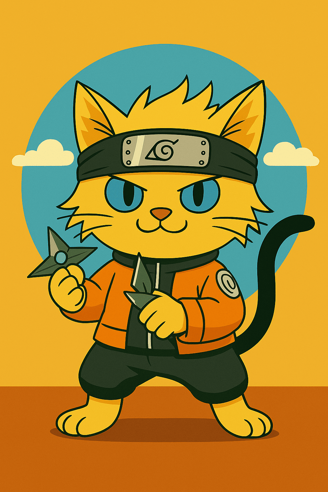

<div align="center">


### MemU: Das Next-Gen Agentic Memory System

[](https://badge.fury.io/py/memu-py)
[](https://opensource.org/licenses/Apache-2.0)
[](https://www.python.org/downloads/)
[](https://discord.gg/memu)
[](https://x.com/memU_ai)
</div>

**MemU** ist ein Next-Generation Agentic Memory System, das die Speicherarchitektur von Agenten aus einer speicherzentrierten Perspektive neu gestaltet—es abstrahiert sie als eine dynamisch entwickelnde Datenschicht, die intelligent relevante Informationen basierend auf dem Kontext organisiert und abruft. Durch adaptive Abruf- und Backtracking-Mechanismen extrahiert es dynamisch die relevantesten Informationen.
Das System verwendet eine **Unified Multimodal Memory**-Architektur mit nativer Unterstützung für verschiedene Datentypen, einschließlich Text, Bilder und Audio, um eine kohärente Speicherrepräsentation zu bilden.

Besuche unsere Homepage: [memu.pro](https://memu.pro/)

---

## ⭐ Gib uns einen Stern auf GitHub

Markiere MemU mit einem Stern, um über neue Veröffentlichungen informiert zu werden und Teil unserer wachsenden Community von KI-Entwicklern zu werden, die intelligente Agenten mit persistenten Speicherkapazitäten entwickeln.


**💬 Tritt unserer Discord-Community bei:** [https://discord.gg/memu](https://discord.gg/memu)

---

## 🚀 Loslegen

Es gibt drei Möglichkeiten, mit MemU zu starten:

### ☁️ Cloud-Version ([Online-Plattform](https://app.memu.so))

Der schnellste Weg, deine Anwendung mit memU zu integrieren. Perfekt für Teams und Einzelpersonen, die sofortigen Zugriff ohne komplizierte Einrichtung wünschen. Wir hosten die Modelle, APIs und den Cloud-Speicher, um sicherzustellen, dass deine Anwendung die beste KI-Speicherqualität erhält.

- **Sofortiger Zugriff** - Integriere KI-Erinnerungen in Minuten
- **Verwaltete Infrastruktur** - Wir kümmern uns um Skalierung, Updates und Wartung für optimale Speicherqualität
- **Premium-Support** - Abonniere und erhalte priorisierte Unterstützung von unserem Engineering-Team

### Schritt-für-Schritt

**Schritt 1:** Konto erstellen

Erstelle ein Konto auf https://app.memu.so

Gehe dann zu https://app.memu.so/api-key/, um API-Schlüssel zu generieren.

**Schritt 2:** Drei Zeilen zu deinem Code hinzufügen
```python
pip install memu-py

# Beispiel
from memu import MemuClient
```

**Schritt 3:** Schnellstart
```python
# Initialisierung
memu_client = MemuClient(
    base_url="https://api.memu.so",
    api_key=os.getenv("MEMU_API_KEY")
)
memu_client.memorize_conversation(
    conversation=conversation_text,
    user_id="user001",
    user_name="User",
    agent_id="assistant001",
    agent_name="Assistant"
)
```
Siehe [API reference](docs/API_REFERENCE.md) oder [unseren Blog](https://memu.pro/blog) für weitere Details.

📖 **Siehe [`example/client/memory.py`](example/client/memory.py) für vollständige Integrationsdetails**

✨ **Das war's!** MemU merkt sich alles und hilft deiner KI, aus vergangenen Gesprächen zu lernen.

### 🏢 Enterprise Edition

Für Organisationen, die maximale Sicherheit, Anpassung, Kontrolle und beste Qualität benötigen:

- **Kommerzielle Lizenz** - Proprietäre Funktionen, Nutzungsrechte und White-Label-Optionen
- **Kundenspezifische Entwicklung** - SSO/RBAC-Integration, dediziertes Algorithmus-Team
- **Intelligenz & Analytik** - Nutzerverhaltensanalyse, Echtzeitüberwachung, Agentenoptimierung
- **Premium-Support** - 24/7 Support, SLAs, Implementierungsservices

📧 **Unternehmensanfragen:** [contact@nevamind.ai](mailto:contact@nevamind.ai)

### 🏠 Selbst-Hosting (Community Edition)

Für Benutzer und Entwickler, die lokale Kontrolle, Datenschutz oder Anpassungen bevorzugen:

* **Datenschutz** - Behalte sensible Daten in deiner Infrastruktur
* **Anpassung** - Passe die Plattform an deine Anforderungen an
* **Kostenkontrolle** - Vermeide wiederkehrende Cloud-Gebühren

Siehe [Self Hosting README](README.self_host.md)

---

## ✨ Hauptfunktionen

### 🎥 Demo-Video

<div align="left">
  <a href="https://www.youtube.com/watch?v=qZIuCoLglHs">
    
  </a>
  <br>
  <em>Klicke, um das MemU-Demonstrationsvideo anzusehen</em>
</div>

---
## 🎓 **Anwendungsfälle**

| | | | |
|:---:|:---:|:---:|:---:|
| <br>**KI-Begleiter** | <br>**KI-Rollenspiel** | <br>**KI-IP-Charaktere** | <br>**KI-Bildung** |
| <br>**KI-Therapie** | <br>**KI-Roboter** | <br>**KI-Kreation** | Mehr...|
---

## 🤝 Mitwirken

Wir fördern Vertrauen durch Open-Source-Zusammenarbeit. Deine kreativen Beiträge treiben die Innovation von memU voran. Entdecke unsere GitHub-Issues und Projekte, um loszulegen und deinen Beitrag zur Zukunft von memU zu leisten.

📋 **[Lies unseren detaillierten Beitrag-Leitfaden →](CONTRIBUTING.md)**

### **📄 Lizenz**

Durch deinen Beitrag zu MemU stimmst du zu, dass deine Beiträge unter der **Apache License 2.0** lizenziert werden.

---

## 🌍 Community
Für weitere Informationen kontaktiere info@nevamind.ai

- **GitHub Issues:** Melde Fehler, fordere Funktionen an und verfolge die Entwicklung. [Ein Issue einreichen](https://github.com/NevaMind-AI/memU/issues)

- **Discord:** Erhalte Support in Echtzeit, chatte mit der Community und bleibe auf dem Laufenden. [Tritt bei](https://discord.com/invite/hQZntfGsbJ)

- **X (Twitter):** Folge uns für Updates, KI-Einblicke und Ankündigungen. [Folge uns](https://x.com/memU_ai)

---

## 🤝 Ökosystem

Wir sind stolz darauf, mit großartigen Organisationen zusammenzuarbeiten:

<div align="center">

### Entwicklungstools
<a href="https://github.com/TEN-framework/ten-framework"></a>
<a href="https://github.com/openagents-org/openagents"></a>
<a href="https://github.com/camel-ai/camel"></a>
<a href="https://github.com/eigent-ai/eigent"></a>
<a href="https://github.com/milvus-io/milvus"></a>
<a href="https://xroute.ai/"></a>
<a href="https://jaaz.app/"></a>
<a href="https://github.com/Buddie-AI/Buddie"></a>
<a href="https://github.com/bytebase/bytebase"></a>
</div>

---

*Interessiert an einer Partnerschaft mit MemU? Kontaktiere uns unter [contact@nevamind.ai](mailto:contact@nevamind.ai)*

---

## 📱 Tritt unserer WeChat-Community bei

Verbinde dich mit uns auf WeChat für die neuesten Updates, Community-Diskussionen und exklusive Inhalte:

<div align="center">


*Scanne einen der QR-Codes oben, um unserer WeChat-Community beizutreten*
</div>

---

*Bleibe mit der MemU-Community verbunden! Tritt unseren WeChat-Gruppen für Diskussionen in Echtzeit, technischen Support und Networking bei.*
