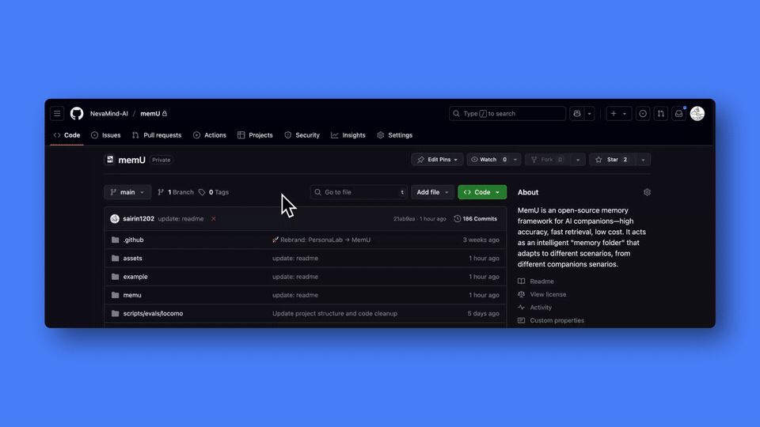
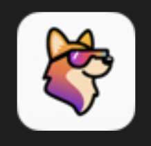
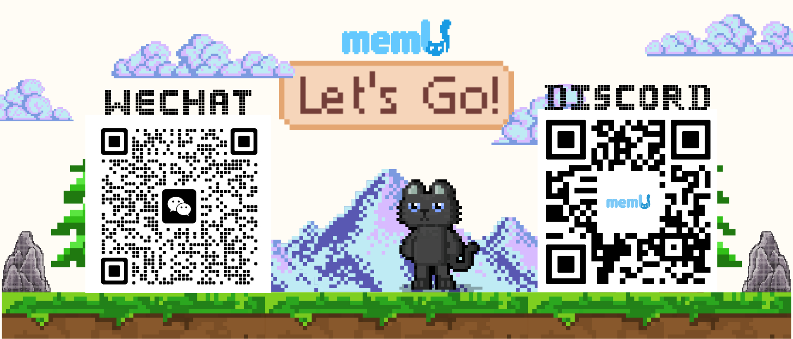

<div align="center">


### MemU: A Future-Oriented Agentic Memory System

[](https://badge.fury.io/py/memu-py)
[](https://opensource.org/licenses/Apache-2.0)
[](https://www.python.org/downloads/)
[](https://discord.gg/memu)
[](https://x.com/memU_ai)
</div>

MemU is a future-oriented Agentic Memory System that addresses the core issue of **inaccurate retrieval in traditional RAG-based memory frameworks**.

It redefines agent memory from a **memory-first perspective** by abstracting it as a dynamically evolving data layer. This layer intelligently organizes and surfaces relevant information based on the current task and context, dynamically extracting the most pertinent content through **adaptive retrieval** and **backtracking mechanisms**—while maintaining retrieval efficiency and ensuring information integrity and accuracy.MemU adopts a **Unified Multimodal Memory architecture** that enables AI agents to integrate and reason over diverse information sources, significantly enhancing memory performance in complex scenarios.

MemU offers several convenient ways to get started right away:

- **One call = response + memory**
  👉 memU Response API: https://memu.pro/docs#responseapi

- **Try it instantly**
  👉 https://app.memu.so/quick-start
---

## ⭐ Star Us on GitHub

Star MemU to get notified about new releases and join our growing community of AI developers building intelligent agents with persistent memory capabilities.



**💬 Join our Discord community:** [https://discord.gg/memu](https://discord.gg/memu)

---
## Roadmap

memU v0.3.0-Alpha has been released! This version initializes the memorize and retrieve workflows with the new 3-layer architecture.

Starting from this release, memU will roll out multiple features in the short- to mid-term:

### Core capabilities iteration
- [x] **Multi-modal enhancements** – Support for images, audio, and video
- [ ] **Intention** – Higher-level decision-making and goal management
- [ ] **Multi-client support** – Switch between OpenAI, Deepseek, Gemini, etc.
- [ ] **Data persistence expansion** – Support for Postgres, S3, DynamoDB
- [ ] **Benchmark tools** – Test agent performance and memory efficiency
- [ ] ……

### Upcoming open-source repositories
- [ ] **memU-ui** – The web frontend for memU, providing developers with an intuitive and visual interface
- [ ] **memU-server** – Powers memU-ui with reliable data support, ensuring efficient reading, writing, and maintenance of agent memories

## 🧩 Why MemU?

Most memory systems in current LLM pipelines rely heavily on explicit modeling, requiring manual definition and annotation of memory categories. This limits AI’s ability to truly understand memory and makes it difficult to support diverse usage scenarios.

MemU offers a flexible and robust alternative, inspired by hierarchical storage architecture in computer systems. It progressively transforms heterogeneous input data into queryable and interpretable textual memory.

Its core architecture consists of three layers: **Resource Layer → Memory Item Layer → MemoryCategory Layer.**


- **Resource Layer**
  A multimodal raw data warehouse, also serving as the ground truth layer, providing a semantic foundation for the memory system.

- **Memory Item Layer**
  A unified semantic abstraction layer, functioning as the system’s semantic cache, supplying high-density semantic vectors for downstream retrieval and reasoning.

- **MemoryCategory Layer**
  A thematic document layer, mimicking human working memory mechanisms, balancing short-term response efficiency and long-term information completeness.

Through this three-layer design, **MemU brings genuine memory into the agent layer, achieving:**

- **Full Traceability**
  Complete traceability across the three layers—from raw data → memory items → aggregated documents. Enables bidirectional tracking of each knowledge piece’s source and evolution, ensuring transparency and interpretability.

- **End-to-End Memory Lifecycle Management**
  The three core processes correspond to the memory lifecycle: **Memorization → Retrieval → Self-evolution**.

- **Coherent and Scalable Memorization**
  During memorization, the system maintains memory coherence while automatically managing resources to support sustainable expansion.

- **Efficient and Interpretable Retrieval**
  Retrieves information efficiently while preserving interpretability, supporting cross-theme and cross-modal semantic queries and reasoning.

- **Self-Evolving Memory**
  A feedback-driven mechanism continuously adapts the memory structure according to real usage patterns.


#### Quick Start

**Step 1: Install**
```bash
pip install -e .
```

**Step 2: Run the example**
```python
from memu.app import MemoryUser
import logging

async def test_memory_service():
    logging.basicConfig(
        level=logging.INFO,
        format="%(asctime)s [%(levelname)s] %(name)s: %(message)s",
    )
    logger = logging.getLogger("memu")
    logger.setLevel(logging.DEBUG)

    # Initialize MemoryUser with your OpenAI API key
    service = MemoryUser(llm_config={"api_key": "your-openai-api-key"})

    # Memorize a conversation
    memory = await service.memorize(
        resource_url="tests/data/example_conversation.json",
        modality="conversation"
    )

    # Example conversation history for query rewriting
    conversation_history = [
        {"role": "user", "content": "Tell me about the user's preferences"},
        {"role": "assistant", "content": "I'd be happy to help. Let me search the memory."},
        {"role": "user", "content": "What are their habits?"}
    ]

    # Test 1: RAG-based Retrieval with conversation history
    print("\n[Test 1] RAG-based Retrieval with conversation history")
    retrieved_rag = await service.retrieve(
        query="What are their habits?",
        conversation_history=conversation_history,
        method="rag",
        top_k=5
    )
    print(f"Method: {retrieved_rag.get('method')}")
    print(f"Original query: {retrieved_rag.get('original_query')}")
    print(f"Rewritten query: {retrieved_rag.get('rewritten_query')}")
    print(f"Results: {len(retrieved_rag.get('categories', []))} categories, "
          f"{len(retrieved_rag.get('items', []))} items")

    # Test 2: LLM-based Retrieval with conversation history
    print("\n[Test 2] LLM-based Retrieval with conversation history")
    retrieved_llm = await service.retrieve(
        query="What are their habits?",
        conversation_history=conversation_history,
        method="llm",
        top_k=5
    )
    print(f"Method: {retrieved_llm.get('method')}")
    print(f"Original query: {retrieved_llm.get('original_query')}")
    print(f"Rewritten query: {retrieved_llm.get('rewritten_query')}")
    print(f"Results: {len(retrieved_llm.get('categories', []))} categories, "
          f"{len(retrieved_llm.get('items', []))} items")

if __name__ == "__main__":
    import asyncio
    asyncio.run(test_memory_service())
```

See [self hosting README](README.self_host.md) for more details.

---


## ✨ Key Features

### 🎥 Demo Video

<div align="left">
  <a href="https://www.youtube.com/watch?v=qZIuCoLglHs">
    
  </a>
  <br>
  <em>Click to watch the MemU demonstration video</em>
</div>

---
## 🎓 **Use Cases**

| | | | |
|:---:|:---:|:---:|:---:|
| <br>**AI Companion** | <br>**AI Role Play** | <br>**AI IP Characters** | <br>**AI Education** |
| <br>**AI Therapy** | <br>**AI Robot** | <br>**AI Creation** | More...|
---

## 🤝 Contributing

We build trust through open-source collaboration. Your creative contributions drive memU's innovation forward. Explore our GitHub issues and projects to get started and make your mark on the future of memU.

📋 **[Read our detailed Contributing Guide →](CONTRIBUTING.md)**


### **📄 License**

By contributing to MemU, you agree that your contributions will be licensed under the **Apache License 2.0**.

---

## 🌍 Community
For more information please contact info@nevamind.ai

- **GitHub Issues:** Report bugs, request features, and track development. [Submit an issue](https://github.com/NevaMind-AI/memU/issues)

- **Discord:** Get real-time support, chat with the community, and stay updated. [Join us](https://discord.com/invite/hQZntfGsbJ)

- **X (Twitter):** Follow for updates, AI insights, and key announcements. [Follow us](https://x.com/memU_ai)

---

## 🤝 Ecosystem

We're proud to work with amazing organizations:

<div align="center">

### Development Tools
<a href="https://github.com/TEN-framework/ten-framework"></a>
<a href="https://github.com/openagents-org/openagents"></a>
<a href="https://github.com/milvus-io/milvus"></a>
<a href="https://xroute.ai/"></a>
<a href="https://jaaz.app/"></a>
<a href="https://github.com/Buddie-AI/Buddie"></a>
<a href="https://github.com/bytebase/bytebase"></a>
<a href="https://github.com/LazyAGI/LazyLLM"></a>
</div>

---

*Interested in partnering with MemU? Contact us at [contact@nevamind.ai](mailto:contact@nevamind.ai)*

---

## 📱 Join Our WeChat Community

Connect with us on WeChat for the latest updates, community discussions, and exclusive content:

<div align="center">



*Scan any of the QR codes above to join our WeChat community*

</div>

---

*Stay connected with the MemU community! Join our WeChat groups for real-time discussions, technical support, and networking opportunities.*
