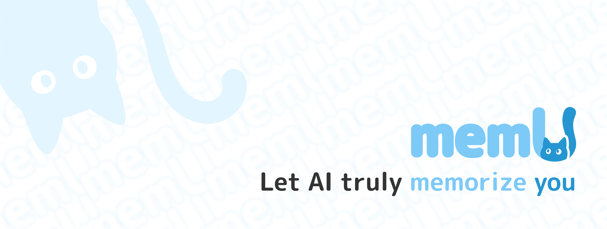

<div align="center">



<h3>memU: The Next-Gen Memory Framework for AI Companions</h3>

[](https://badge.fury.io/py/memu)
[](https://opensource.org/licenses/Apache-2.0)
[](https://www.python.org/downloads/)
[](https://discord.gg/hQZntfGsbJ)
[](https://x.com/Nevamind_ai)
[](https://reddit.com/r/MemU)
[](#)
</div>

**MemU** is an open-source memory framework for AI companions—high accuracy, fast retrieval, low cost. It acts as an intelligent "memory folder" that adapts to different scenarios, from different companions senarios.

With **memU**, you can build AI companions that truly remember you. They learn who you are, what you care about, and grow alongside you through every interaction.

### 🥇 92.9% Accuracy - 💰 90% Cost Reduction - 🤖 AI Companion Specialized
- ✅ **92.9% Accuracy** - State-of-the-art score in Locomo benchmark
- ✅ **Up to 70% Cost Reduction** - Through optimized infrastructure
- ✅ **Advanced Retrieval Strategies** - Multiple methods including semantic search, hybrid search, contextual retrieval
- ✅ **AI Companion Specialization** - Adapt to AI companions application
- ✅ **24/7 Support** - For enterprise customers

---

## ⭐ Star Us on GitHub


**🚀 Join 1,000+ developers building the future of AI memory**

Star MemU to get notified about new releases and join our growing community of AI developers building intelligent agents with persistent memory capabilities.

**💬 Join our Discord community:** [https://discord.gg/hQZntfGsbJ](https://discord.gg/hQZntfGsbJ)

---

## 🚀Get Started

There are three ways to get started with MemU:

### ☁️ Cloud Version ([Online Platform](https://memu.so))

The fastest way to integrate your application with memU. Perfect for teams and individuals who want immediate access without setup complexity. We host the models, APIs, and cloud storage, ensuring your application gets the best quality AI memory.

- **Instant Access** - Start integrating AI memories in minutes
- **Managed Infrastructure** - We handle scaling, updates, and maintenance for optimal memory quality
- **Premium Support** - Subscribe and get priority assistance from our engineering team

#### Step-by-step

**Step 1:** Create account & get your API key
**Step 2:** Add three lines to your code
```python
pip install memu-py

# Example usage
from memu.memory import MemoryAgent
from memu.llm import OpenAIClient

memory_agent = MemoryAgent()
```


### 🏢 Enterprise Edition

For organizations requiring maximum security, customization, control and best quality:

- **Commercial License** - Full proprietary features, commercial usage rights, white-labeling options

- **Custom Development** - SSO/RBAC integration, dedicated algorithm team for scenario-specific framework optimization

- **Intelligence & Analytics** - User behavior analysis, real-time production monitoring, automated agent optimization

- **Premium Support** - 24/7 dedicated support, custom SLAs, professional implementation services

📧 **Enterprise Inquiries:** [contact@nevamind.ai](mailto:contact@nevamind.ai)


### 🏠 Self-Hosting (Community Edition)
For users and developers who prefer local control, data privacy, or customization:

* ✅ **Data Privacy** - Keep sensitive data within your infrastructure
* ✅ **Customization** - Modify and extend the platform to fit your needs
* ✅ **Cost Control** - Avoid recurring cloud fees for large-scale deployments

🚀 **Coming Soon!**


---


## ✨ Key Features

---

## 📋 **Categorized Memories**

**Your AI companion remembers everything about you, organized and ready**


MemU automatically organizes your conversations into meaningful categories - your hobbies, work life, family stories, and personal preferences. Instead of scattered chat fragments, your AI companion builds a structured understanding of who you are, making every conversation feel personal and contextual.

**Key Benefits:**
- 🗂️ **Document-based storage** - Each memory type is stored as readable documents
- 🏷️ **Smart categorization** - Automatic classification by topics and contexts  
- 🔍 **Easy retrieval** - Quick access to relevant information through categories

---

## 🔗 **Memory Connections**

**Your AI companion connects the dots between your stories**


When you mention your love for hiking, your AI companion remembers you talked about buying boots last month, and connects it to your upcoming mountain trip. These connections help your AI understand the full context of your infomation, making conversations feel natural and insightful.

**Key Benefits:**
- 🕸️ **Smart connections** - Your AI links related memories automatically
- 🔄 **Context awareness** - Previous conversations inform current ones

---

## 🧠 **Evolving Insights**

**Your AI companion learns about you even when you're not chatting**


Even when you're not actively talking to it, your AI companion continuously analyzes your stored memories, discovering new patterns and insights about your preferences, habits, and personality. It's like having a friend who's always thinking about you and getting to know you better in the background.

**Key Benefits:**
- 🤔 **Theory of Mind** - Deep understanding of your mental states and preferences
- 📝 **Self-improvement** - Automatically enhances existing memories
- 🌱 **Continuous learning** - Gets smarter about you over time


---

## 🌫️ **Adaptive Forgetting**

**Your AI companion remembers what matters most**


MemU implements an intelligent LRU-like forgetting mechanism where memories naturally fade in importance without disappearing entirely. This mimics human memory patterns - rarely accessed information becomes less prominent while frequently referenced memories gain stronger relevance.

**Key Benefits:**
- ⏰ **Time-based decay** - Unused memories naturally fade in importance
- 🔄 **Usage-based boost** - Recently accessed memories gain higher relevance
- 💾 **Never truly lost** - Information fades but remains retrievable when needed
- 🎯 **Smart prioritization** - Most relevant memories surface first in conversations

---

## 🏆 **Competitive Advantages**


**Why MemU stands out from other memory solutions**

### 🎯 **Higher Memory Accuracy**

MemU achieves **92.09% average accuracy** across all reasoning tasks, significantly outperforming competitors.

| Model    |   Single-Hop |  Multi-Hop | Open Domain | Temporal Reasoning | Avg. Score | 
|-------------|------------|-----------|-------------|------------|---------------------|
| **OpenAI**  | 63.79      | 42.92     | 62.29       | 21.71      | 52.90               |
| **Mem0**    | 67.13      | 51.15     | 72.93       | 55.51      | 66.88               |          |
| **Memobase** | 70.92     | 46.88     | 77.17       | 85.05      | 75.78               |
| **Zep**     | 74.11      | 66.04     | 67.71       | 79.76      | 75.14               |            |
| **MemU**    | **94.88**  | **88.30**  | 77.08      | **92.52**   | **92.09**  |

*Based on comprehensive benchmarks against other memory frameworks*

---

### 🔄 **Flexible Retrieval Strategies**


**Multiple recall methods for every use case**

MemU provides a comprehensive suite of retrieval strategies, allowing you to choose the optimal approach for your specific scenario. From semantic similarity to category search, our flexible system adapts to your needs.

**Available Strategies:**

- 🔍 **Semantic Search** - Find memories by meaning and context using advanced embedding models. Perfect for natural language queries and conceptual searches that go beyond keyword matching.

- 🏷️ **Category-based Retrieval** - Organize memories through topic category classification. Ideal for structured information retrieval and domain-specific searches.

- 🔗 **Graph Traversal** - Discover related information by following memory connections and relationship networks. Enables exploration of indirect relationships and contextual paths between concepts.

- 🎯 **Hybrid Fusion** - Combine multiple strategies using ensemble methods. Delivers optimal performance for complex queries requiring maximum accuracy.

- 🧠 **Active Retrieval** - Determine when to retrieve memories based on conversation context and relevance. Prevents unnecessary retrievals while ensuring important memories are surfaced when needed.
---

### 📖 **Human-Readable Memory Format**

**Memories you can actually read and understand**

Unlike other memory frameworks that store information as fragmented sentences, MemU organizes memories as **coherent, readable documents**. While competitors break down information into scattered fragments, MemU maintains context and structure, enabling easy debugging, manual editing, and seamless integration with existing workflows.

**Readability Benefits:**
- 📝 **Document Structure** - Organized as markdown files with clear headers
- 🔗 **Wiki-like Links** - Documents with interconnected links enabling seamless navigation between related memories
- 📋 **Export Friendly** - Standard formats compatible with any system

---


## 🚀 Quick Start

### **Installation in 30 seconds**

```bash
# Install MemU with all features
pip install memu-py
```

### **3-Line Demo**

```python
from memu.memory import MemoryAgent
from memu.llm import OpenAIClient

# Create AI agent with unified memory
memory_agent = MemoryAgent(llm_client=OpenAIClient(), memory_dir="memory")

# Process conversation with persistent memory
results = memory_agent.process_conversation("Hi, I'm learning Python", "student_123")
```


### **Live Demo**

Try MemU instantly in your browser: [**🔗 Interactive Demo**](https://demo.nevamind.ai)

---

## 📚 Usage Guide & Research Highlights

<div align="center">


### 🎓 **Use Cases**

<table>
<tr>
<td width="33%" align="center">


**🤖 Personal Assistant**

**🎯 Role play**

**🛠️ AI companion**

**🎯 Educational AI**

** note类ai **


**Creation Support**
---

## 🤝 Contributing


### **Join Our Mission**

Help us build the future of AI memory! We welcome contributions of all kinds.

**🌟 Ways to Contribute:**
- 🐛 Report bugs and suggest features
- 📝 Improve documentation and examples  
- 🔧 Add new LLM providers and integrations
- 🧪 Write tests and improve code quality

### **Quick Contribution Guide**

```bash
# 1. Fork and clone
git clone https://github.com/YOUR_USERNAME/MemU.git

# 2. Create feature branch
git checkout -b feature/amazing-feature

# 3. Make changes and test
pip install -e .
python -m pytest

# 4. Submit PR
git push origin feature/amazing-feature
```

**🎯 Current Priorities:**
- Multi-modal memory support (images, audio)
- Performance optimizations
- Additional embedding providers
- Enterprise security features

---

## 🌍 Community

<table>
<tr>
<td width="50%">


</td>
<td width="50%">


</td>
</tr>
</table>

### **Connect with the MemU Community**

<a href="https://discord.gg/hQZntfGsbJ">
    
</a>
<a href="https://github.com/NevaMind-AI/MemU/discussions">
    
</a>
<a href="https://x.com/nevamind_ai">
    
</a>
<a href="https://reddit.com/r/MemU">
    
</a>
<a href="https://t.me/MemU_AI">
    
</a>
<a href="#">
    
</a>
<a href="https://www.youtube.com/@MemU_AI">
    
</a>

### **📞 Get Support**

| Channel | Best For |
|---------|----------|
| 💬 [Discord](https://discord.gg/hQZntfGsbJ) | Real-time chat, community help |
| 🗣️ [GitHub Discussions](https://github.com/NevaMind-AI/MemU/discussions) | Feature requests, Q&A |
| 🐛 [GitHub Issues](https://github.com/NevaMind-AI/MemU/issues) | Bug reports, technical issues |
| 📱 [Reddit](https://reddit.com/r/MemU) | Community discussions, shared experiences |
| 📞 [Telegram](https://t.me/MemU_AI) | Quick updates, announcements |
| 💬 [WeChat](https://example.com/wechat-qr) | 中文社区支持 |
| 🎥 [YouTube](https://www.youtube.com/@MemU_AI) | Tutorials, demos, updates |
| 📧 [Email](mailto:contact@nevamind.ai) | Enterprise inquiries, partnerships |

### **🏆 Contributors**

<a href="https://github.com/NevaMind-AI/MemU/graphs/contributors">
  
</a>


### **🔒 Security & License**

Report security issues to [security@nevamind.ai](mailto:security@nevamind.ai)

Licensed under [Apache License 2.0](LICENSE)

---


**MemU** - Building the memory foundation for next-generation AI agents 🧠✨

*Made with ❤️ by the [NevaMind AI](https://nevamind.ai) team*

 