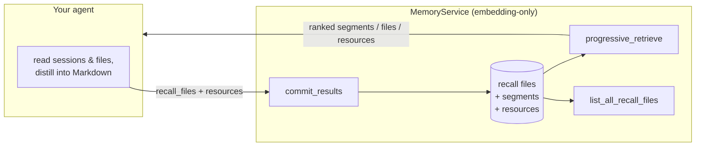

<div align="center">

# memU

### Personal memory, stored as files

**Fast retrieval. Higher accuracy. Lower cost.**

[](https://badge.fury.io/py/memu-py)
[](https://opensource.org/licenses/Apache-2.0)
[](https://www.python.org/downloads/)
[](https://discord.com/invite/hQZntfGsbJ)
[](https://x.com/memU_ai)

<a href="https://trendshift.io/repositories/17374" target="_blank"></a>

</div>

---

memU is an **embedding-only memory store for AI agents**. Modern agents are already excellent readers and writers — they don't need a second LLM pipeline re-summarizing their context behind their back. So memU splits the work:

- **Your agent** does the thinking: it reads sessions and files, decides what is worth keeping, and distills it into Markdown.
- **memU** does the persistence: it stores those documents, embeds them for search, and hands back compact, ranked context on demand.

No LLM call happens inside the service — the only model calls are embeddings. That makes every operation single-shot, cheap, and fast enough to run on a per-turn hook.

## Quick start

```python
from memu.app import MemoryService

service = MemoryService(
    database_config={"metadata_store": {"provider": "sqlite", "dsn": "sqlite:///memu.sqlite3"}},
)

# 1. Persist agent-prepared memory: recall files (memory/skill tracks) + resources
await service.commit_results(
    recall_files=[
        {
            "name": "Profile",
            "track": "memory",
            "description": "who the user is",
            "content": "# Profile\n- prefers dark roast coffee\n- ships on Fridays",
        },
        {
            "name": "deploy-checklist",
            "track": "skill",
            "description": "how to deploy this repo",
            "content": "1. run tests\n2. tag\n3. push",
        },
    ],
    resource=[{"path": "/abs/path/notes.md", "description": "meeting notes from the launch review"}],
)

# 2. See what is stored, across every track
files = await service.list_all_recall_files()

# 3. Single-shot embedding retrieval over segments / files / resources
context = await service.progressive_retrieve("What should I know about this user's launch preferences?")
```

Or straight from the terminal — no code:

```bash
export OPENAI_API_KEY=sk-...

npx memu-cli commit results.json     # {"recall_files": [...], "resource": [...]}
npx memu-cli list-files
npx memu-cli retrieve "What should I know about this user's launch preferences?"
```

State persists in a local SQLite database (`./data/memu.sqlite3` by default), so commit in one invocation and retrieve in the next.

## How it works


```mermaid
flowchart LR
    subgraph agent["Your agent"]
        distill["read sessions & files,\ndistill into Markdown"]
    end

    subgraph memu["MemoryService (embedding-only)"]
        commit["commit_results"]
        store[("recall files\n+ segments\n+ resources")]
        retrieve["progressive_retrieve"]
        list["list_all_recall_files"]
    end

    distill -->|"recall_files + resources"| commit --> store
    store --> retrieve -->|"ranked segments / files / resources"| agent
    store --> list
```

### The data model

Memory is a set of **recall files** — one Markdown document per topic (`track="memory"`) or per learned skill (`track="skill"`). Committing a file also writes its search index:

| Record | What it is | How it's embedded |
|---|---|---|
| **RecallFile** | The Markdown document itself (`name`, `track`, `description`, `content`) | `name: description`, once at creation |
| **RecallFileSegment** | Searchable slices of a file | memory track: one per content line (headings skipped); skill track: one `name: description` segment per skill |
| **Resource** | A raw source on disk (`url`, `caption`) | its one-line caption |

Segments are reconciled on every commit: lines that disappeared are deleted, only genuinely new lines are embedded, unchanged lines keep their vectors — so re-committing a lightly edited file is nearly free.

### Retrieval

`progressive_retrieve(query)` embeds the query **once** and returns three ranked layers:

- `segments` — the matched slices, narrowest and usually most on-point, each with a `score`
- `files` — the documents those segments belong to (usually what you want), each scored by its best segment and carrying its linked `resource_urls`
- `resources` — matching raw sources, for when summaries are not enough

There is no intention routing, sufficiency checking, or summarization — one embedding call in, ranked context out.

## API

### `commit_results(*, recall_files=None, resource=None, user=None)`

Create-or-update, straight into storage:

- Each `recall_files` item is `{"name", "track", "description", "content"}`. Files are **keyed by `name` within their `track`** — committing an existing name replaces that file's content (and reconciles its segments); a new name creates the file and embeds its `name: description` for file-level recall.
- Each `resource` item is `{"path", "description"}`. Resources are **keyed by `path`** — an existing resource at the same path is replaced, and the description becomes the embedded caption.
- `user` scopes every written record, e.g. `user={"user_id": "alice"}`.

Returns the committed records (embeddings stripped).

### `list_all_recall_files(where=None)`

Lists every recall file across both tracks — use it before inventing new file names, so revisions land on existing files instead of creating near-duplicates. `where` filters by user scope.

### `progressive_retrieve(query, where=None)`

The three ranked layers described above. Raises `ValueError("empty_query")` on a blank query. Tune it via `progressive_retrieve_config`:

```python
service = MemoryService(
    progressive_retrieve_config={
        "file": {"top_k": 10, "tracks": ["memory"]},   # segment layer: how many, which tracks
        "resource": {"enabled": False},                 # resource layer: off entirely
    },
)
```

## CLI

Every command reads the same `MEMU_*` config as the library, so the CLI composes like the API:

| Command | Alias | What it does |
|---|---|---|
| `memu retrieve <query>` | `search` | Ranked segments/files/resources as JSON |
| `memu list-files` | | Every recall file across both tracks (`--json` for raw) |
| `memu commit <payload.json>` | | Persist a prepared payload (`-` reads stdin) |

The commit payload mirrors the API:

```json
{
  "recall_files": [
    {"name": "Profile", "track": "memory", "description": "who the user is", "content": "# Profile\n- ..."}
  ],
  "resource": [
    {"path": "/abs/path/notes.md", "description": "meeting notes"}
  ]
}
```

Flags: `--db`, `--provider`, `--embed-model`, `--base-url`, `--api-key`, `--json` — each with a `MEMU_*` env fallback (see Configuration).

## Host adapter: memory for desktop coding agents

`memu-codex` runs memU as a sidecar to Codex-style agents (ADR 0008/0009). It binds two seams:

- **record** — a scheduled bridging task slices new session logs into self-contained job files; the agent itself distills them into memory/skill Markdown; `commit` submits whatever the agent left on disk back through `commit_results`.
- **inject** — a standing instruction in the host's global instruction file (`~/.codex/AGENTS.md`) tells the agent to run `memu-codex retrieve` (→ `progressive_retrieve`) before answering.

Setup, end to end:

```bash
pip install memu-py                  # puts memu + memu-codex on PATH
memu-codex docs install              # the full agent-facing install guide

# 1. configure once — ~/.memu/config.env (absolute paths; scheduled tasks have no cwd)
#      MEMU_DB=/Users/you/.memu/memu.sqlite3
#      MEMU_LLM_PROVIDER=openai
#      MEMU_API_KEY=<key or env-var name>
memu-codex doctor                    # prove config + store + retrieval all resolve

# 2. inject seam — patch ~/.codex/AGENTS.md (idempotent, upgrade-safe)
memu-codex install-instruction

# 3. record seam — run on a schedule
memu-codex prepare                   # slice new sessions into job files
#   ...the agent works through the jobs...
memu-codex commit                    # submit produced memory/skills back into memU
```

Adding another host means implementing one `TranscriptSource` (where its session logs live, how its records are shaped) plus a thin CLI — the pipeline and instruction text are shared.

## Installation

```bash
pip install memu-py          # library + memu + memu-codex CLIs
npx memu-cli --help          # CLI via npm launcher (engine: PyPI package memu-cli)
uvx --from memu-cli memu     # CLI via uv, no install
```

Install only one of `memu-py` / `memu-cli` in a given environment — they ship the same `memu` module.

## Configuration

Values resolve in order: process env → `~/.memu/config.env` → default. Every CLI flag has a matching variable:

| Setting | Env var | Default |
|---|---|---|
| Store | `MEMU_DB` | `./data/memu.sqlite3` (CLI); **required** for host adapters |
| Embedding provider | `MEMU_LLM_PROVIDER` | `openai` (also: `jina`, `voyage`, `doubao`, `openrouter`) |
| API key | `MEMU_API_KEY` | the provider's env var, e.g. `OPENAI_API_KEY` |
| Embedding model | `MEMU_EMBED_MODEL` | the provider's default |
| Base URL | `MEMU_BASE_URL` | the provider's default |

### Storage backends

| Provider | DSN | Vector search | Use for |
|---|---|---|---|
| `inmemory` | — | brute-force cosine | tests, throwaway sessions |
| `sqlite` | `sqlite:///path.sqlite3` | brute-force cosine | local/default, single writer |
| `postgres` | `postgresql://...` | pgvector | concurrent access, large stores (`pip install "memu-py[postgres]"`) |

```python
service = MemoryService(
    database_config={"metadata_store": {"provider": "postgres", "dsn": "postgresql://..."}},
    embedding_profiles={"default": {"provider": "jina"}},
)
```

### Multi-tenancy

Every record carries optional scope fields (`user_id`, `agent_id` by default). Pass `user=` on writes and `where=` on reads to partition one store:

```python
await service.commit_results(recall_files=[...], user={"user_id": "alice"})
await service.progressive_retrieve("launch preferences", where={"user_id": "alice"})
```

Need different scope fields? Supply your own model — filters are validated against it, unknown fields raise:

```python
from pydantic import BaseModel

class TeamScope(BaseModel):
    team_id: str | None = None
    user_id: str | None = None

service = MemoryService(user_config={"model": TeamScope})
```

## FAQ

**Where do the LLM calls happen?** In your agent, before `commit_results` and after `progressive_retrieve`. memU itself only calls the embedding API — indexing on write, one query embedding on read.

**How do I revise a memory?** Re-commit the same `name` within the same `track` with new content. Check `list-files` first so revisions land on existing files instead of creating near-duplicates.

**How large can the store get?** Segment ranking is brute-force cosine on sqlite/inmemory — comfortable to roughly 100k segments. Beyond that, use the Postgres backend with pgvector.

**`memu-py` vs `memu-cli`?** Same `memu` module, two release channels: `memu-py` is the library train, `memu-cli` the CLI train consumed by the npm launcher. Install exactly one per environment.

**What happened to `memorize` / `retrieve_workspace`?** Removed in the agentic-only refactor ([#485](https://github.com/NevaMind-AI/memU/pull/485)): the in-service LLM pipelines (multimodal preprocessing, workflow engine, LLM-routed retrieval) are gone in favor of the three-operation surface above.

## Development

```bash
make install     # uv sync + pre-commit hooks
make test        # pytest with coverage
make check       # lock check, pre-commit, mypy, deptry
```

Architecture decisions live in [`docs/adr/`](docs/adr/) — notably tracked workspace memorization (ADR 0006), the segment/file/resource retrieval lines (ADR 0007), and the host-adapter seams (ADR 0008/0009).

## License

Apache-2.0
