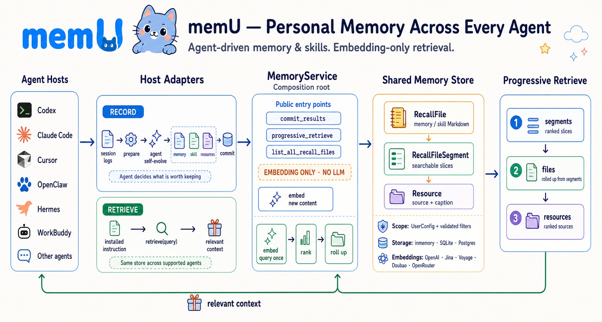
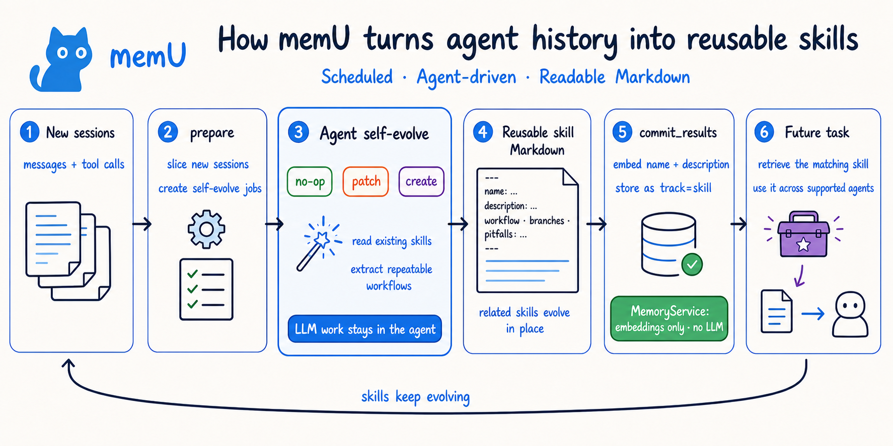

<div align="center">

# memU

### Personal memory, stored as Wiki

**Across Sessions. Across Agents. Across Devices.**

[](https://badge.fury.io/py/memu-cli)
[](https://opensource.org/licenses/Apache-2.0)
[](https://www.python.org/downloads/)
[](https://discord.com/invite/hQZntfGsbJ)
[](https://x.com/memU_ai)

<a href="https://trendshift.io/repositories/17374" target="_blank"></a>

</div>

---

memU is a lightweight, agent-driven memory system that gives users a shared LLM wiki across sessions, agents, and devices. It automatically distills your own reusable skills from your agent history. Its core memory logic is only 500 lines — compact enough to inspect, understand, and adapt.

## Quick start

memU works with Codex, Claude Code, Cursor, OpenClaw, Hermes, WorkBuddy, and more. See [Host adapters](#host-adapters-memory-for-desktop-coding-agents).

Choose Cloud or Local, then send the corresponding message to your agent.

### Cloud

**Cross-device · Free · Unlimited · [View online](https://memu.so)**

Cloud setup asks for a memU API key. If you do not have one yet, register at
[memu.so](https://memu.so) and create one before continuing.

> Read [https://raw.githubusercontent.com/NevaMind-AI/MemU/main/SKILL.md](https://raw.githubusercontent.com/NevaMind-AI/MemU/main/SKILL.md) and follow it to install memU.

### Local / self-hosted

**Private · Single-device · Embedding key required**

> Read [https://raw.githubusercontent.com/NevaMind-AI/MemU/main/SKILL.md](https://raw.githubusercontent.com/NevaMind-AI/MemU/main/SKILL.md) and follow it to install memU.

## How it works



## Automatic skill extraction

Once the scheduled bridging task is installed, memU can turn useful agent history into reusable Markdown skills automatically.



1. **Capture new sessions.** The host adapter reads new session history, including messages and tool calls.
2. **Prepare self-evolve jobs.** `prepare` slices each session into a self-contained job with the paths and context the agent needs.
3. **Let the agent decide.** The agent reads related existing skills, then chooses to do nothing, patch an existing skill, or create a new one.
4. **Write readable skill Markdown.** Each skill has a name, description, and reusable workflow, including useful branches, edge cases, and pitfalls.
5. **Commit and index.** `commit` submits changed skill files through `commit_results`; memU embeds the skill name and description and stores it under the `skill` track.
6. **Retrieve it later.** On a similar future task, memU returns the relevant skill so any connected agent can use the learned workflow.

The judgment and synthesis stay inside the agent. `MemoryService` makes no LLM or chat calls; it stores, embeds, and retrieves the skill Markdown the agent prepared.

## Host adapters: memory for desktop coding agents

memU runs as a sidecar to a desktop agent (ADR 0008/0009/0010), one binary per host. Each binds two seams:

- **record** — a scheduled bridging task slices new session logs into self-contained job files; the agent itself distills them into memory/skill Markdown; `commit` submits whatever the agent left on disk back through `commit_results`.
- **inject** — a standing instruction in the host's instruction file tells the agent to run `<binary> retrieve` (→ `progressive_retrieve`) before answering.

| Host | Binary | Session log it mines | Instruction file it patches |
| --- | --- | --- | --- |
| Codex | `memu-codex` | `~/.codex/sessions/**/*.jsonl` | `~/.codex/AGENTS.md` |
| Claude Code | `memu-claude-code` | `~/.claude/projects/<project>/<session>.jsonl` | `~/.claude/CLAUDE.md` |
| Cursor (Agent/CLI) | `memu-cursor` | `~/.cursor/projects/<project>/agent-transcripts/**.jsonl` | `./AGENTS.md` (per project) |
| OpenClaw | `memu-openclaw` | `~/.openclaw/agents/<agentId>/sessions/*.jsonl` | `~/.openclaw/workspace/AGENTS.md` |
| Hermes Agent | `memu-hermes` | `~/.hermes/state.db` (SQLite, read-only) | `~/.hermes/SOUL.md` |
| WorkBuddy | `memu-workbuddy` | `~/.workbuddy/projects/<project>/<session>.jsonl` | `~/.workbuddy/MEMORY.md` |
| **any other agent** | `memu-agent` | found by `memu-agent detect` (JSONL dialect sniffed) | found by `detect` (AGENTS.md / CLAUDE.md / SOUL.md / …) |

For agents without a dedicated binary, `memu-agent detect` probes the machine and reports per agent whether **memorization** works (a recognizable session log exists) and whether **retrieval** works (an instruction file exists to patch) — then the same verbs run against what it found.

All hosts share one configured memory backend via `~/.memu/config.env` — local
or MemU Cloud. What one host's sessions taught memU, another host retrieves.

Installation is the one-message setup at the top of this README. [SKILL.md](SKILL.md) is the routing skill it hands your agent: install the package, identify which host you are (falling back to `memu-agent detect` for anything without a dedicated adapter), print that host's packaged install guide (`<binary> docs install`), and follow it — configure the memory backend, register the scheduled bridging task, patch the instruction file, each step behind a verify gate — then report which seams (memorization / retrieval) are now active.

Afterwards `<binary> doctor` proves the whole loop resolves: config, selected
mode, and a live retrieval.

Adding another host means implementing one `TranscriptSource` (where its session logs live, how its records are shaped) plus a `HostSpec`-sized CLI — the pipeline, verbs, and instruction text are shared.

## CLI

With memU Cloud, sign in at [memu.so](https://memu.so) to view your memory files. With a local installation, memory lives in the shared store configured by `MEMU_DB` in `~/.memu/config.env` — typically `~/.memu/memu.sqlite3` for local SQLite, or a Postgres DSN.

Once installed, your agent retrieves relevant memory automatically before answering. To retrieve manually, run the adapter for your host:

```bash
memu-codex retrieve "What should I remember about this project?"
# or: memu-claude-code / memu-cursor / memu-openclaw / memu-hermes / memu-workbuddy / memu-agent
```

Install or invoke the CLI directly:

```bash
pip install memu-cli         # library + memu + memu-codex CLIs
npx memu-cli --help          # CLI via npm launcher (engine: PyPI package memu-cli)
uvx --from memu-cli memu     # CLI via uv, no install
```

## Configuration

Values resolve in order: process env → `~/.memu/config.env` → default. memU
supports Local and Cloud memory backends, selected by `MEMU_MEMORY_MODE`; an
unset mode remains Local for backward compatibility.

For Local / self-hosted installations, every CLI flag has a matching variable:

| Setting | Env var | Default |
|---|---|---|
| Store | `MEMU_DB` | `./data/memu.sqlite3` (CLI); **required** for host adapters |
| Embedding provider | `MEMU_EMBED_PROVIDER` | `openai` (also: `jina`, `voyage`, `doubao`, `openrouter`); legacy `MEMU_LLM_PROVIDER` still read |
| API key | `MEMU_API_KEY` | the provider's env var, e.g. `OPENAI_API_KEY` |
| Embedding model | `MEMU_EMBED_MODEL` | the provider's default |
| Base URL | `MEMU_BASE_URL` | the provider's default |

Run `<binary> doctor` to display the resolved mode and verify the same retrieval
path the host uses.

### Storage backends

| Provider | DSN | Vector search | Use for |
|---|---|---|---|
| `inmemory` | — | brute-force cosine | tests, throwaway sessions |
| `sqlite` | `sqlite:///path.sqlite3` | brute-force cosine | local/default, single writer |
| `postgres` | `postgresql://...` | pgvector | concurrent access, large stores (`pip install "memu-cli[postgres]"`) |

```python
service = MemoryService(
    database_config={"metadata_store": {"provider": "postgres", "dsn": "postgresql://..."}},
    embedding_profiles={"default": {"provider": "jina"}},
)
```
## License

Apache-2.0
