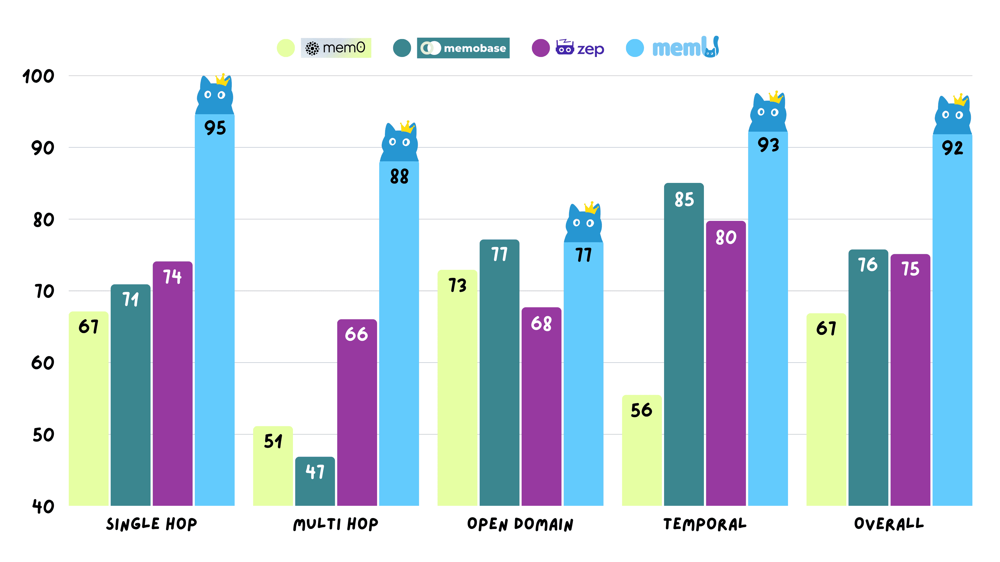

<div align="center">


<h3>memU: The Next-Gen Memory Framework for AI Companions</h3>

[](https://badge.fury.io/py/memu)
[](https://opensource.org/licenses/Apache-2.0)
[](https://www.python.org/downloads/)
[](https://discord.gg/hQZntfGsbJ)
[](https://x.com/Nevamind_ai)
[](https://reddit.com/r/MemU)
[](#)
</div>

**MemU** is an open-source memory framework for AI companions—high accuracy, fast retrieval, low cost. It acts as an intelligent "memory folder" that adapts to different scenarios, from different companions senarios.

With **memU**, you can build AI companions that truly remember you. They learn who you are, what you care about, and grow alongside you through every interaction.

### 🥇 92.9% Accuracy - 💰 90% Cost Reduction - 🤖 AI Companion Specialized
- ✅ **AI Companion Specialization** - Adapt to AI companions application
- ✅ **92.9% Accuracy** - State-of-the-art score in Locomo benchmark
- ✅ **Up to 70% Cost Reduction** - Through optimized infrastructure
- ✅ **Advanced Retrieval Strategies** - Multiple methods including semantic search, hybrid search, contextual retrieval
- ✅ **24/7 Support** - For enterprise customers

---

## ⭐ Star Us on GitHub


**🚀 Join 1,000+ developers building the future of AI memory**

Star MemU to get notified about new releases and join our growing community of AI developers building intelligent agents with persistent memory capabilities.

**💬 Join our Discord community:** [https://discord.gg/hQZntfGsbJ](https://discord.gg/hQZntfGsbJ)

---

## 🚀Get Started

There are three ways to get started with MemU:

### ☁️ Cloud Version ([Online Platform](https://memu.so))

The fastest way to integrate your application with memU. Perfect for teams and individuals who want immediate access without setup complexity. We host the models, APIs, and cloud storage, ensuring your application gets the best quality AI memory.

- **Instant Access** - Start integrating AI memories in minutes
- **Managed Infrastructure** - We handle scaling, updates, and maintenance for optimal memory quality
- **Premium Support** - Subscribe and get priority assistance from our engineering team

#### Step-by-step

**Step 1:** Create account & get your API key

**Step 2:** Add three lines to your code
```python
pip install memu-py

# Example usage
from memu.memory import MemoryAgent
from memu.llm import OpenAIClient

memory_agent = MemoryAgent()
```


### 🏢 Enterprise Edition

For organizations requiring maximum security, customization, control and best quality:

- **Commercial License** - Full proprietary features, commercial usage rights, white-labeling options
- **Custom Development** - SSO/RBAC integration, dedicated algorithm team for scenario-specific framework optimization
- **Intelligence & Analytics** - User behavior analysis, real-time production monitoring, automated agent optimization
- **Premium Support** - 24/7 dedicated support, custom SLAs, professional implementation services
📧 **Enterprise Inquiries:** [contact@nevamind.ai](mailto:contact@nevamind.ai)


### 🏠 Self-Hosting (Community Edition)
For users and developers who prefer local control, data privacy, or customization:

* **Data Privacy** - Keep sensitive data within your infrastructure
* **Customization** - Modify and extend the platform to fit your needs
* **Cost Control** - Avoid recurring cloud fees for large-scale deployments

🚀 **Coming Soon!**


---


## ✨ Key Features

### Autonomous Memory Management System

#### **Organize** - Autonomous Memory Management
Your memories are structured as intelligent folders managed by a dedicated memory agent. We do not do explicit modeling for memories. The memory agent automatically decides what to record, modify, or archive based on relevance and usage patterns. Think of it as having a personal librarian who knows exactly how to organize your thoughts.

#### **Link** - Interconnected Knowledge Graph
Memories don't exist in isolation. Our system automatically creates meaningful connections between related memories, building a rich network of hyperlinked documents. As your knowledge base grows, so does the web of relationships, making information discovery intuitive and contextual.

#### **Evolve** - Continuous Self-Improvement
Even when offline, your memory system keeps working. It generates new insights by analyzing existing memories, identifies patterns, and creates summary documents through self-reflection. Your knowledge base becomes smarter over time, not just larger.

#### **Never Forget** - Intelligent Retention System
We've revolutionized memory persistence with a dynamic importance algorithm. Recently referenced memories gain higher priority, ensuring that what matters most to you now stays readily accessible. The system adapts to your changing needs, keeping relevant information at your fingertips while gracefully archiving what's no longer critical.
---

## Advantages

### Higher Memory Accuracy
MemU achieves 92.09% average accuracy across all reasoning tasks, significantly outperforming competitors.



### Flexible Retrieval Strategies

MemU provides a comprehensive suite of retrieval strategies, allowing you to choose the optimal approach for your specific scenario. From semantic similarity to category search, our flexible system adapts to your needs.

### Human-Readable & Analyzable Memory Architecture

Unlike other memory frameworks that store information as fragmented sentences, MemU organizes memories as coherent, readable documents while simultaneously transforming raw data into structured, analyzable datasets. While competitors break down information into scattered fragments, MemU maintains complete context and relationships, enabling easy debugging, manual editing, seamless analytics, and effortless integration with existing workflows.

**Key Benefits:**
- 📝 **Document Structure** - Organized as markdown files with clear headers for human readability
- 🔗 **Wiki-like Links** - Documents with interconnected links enabling seamless navigation between related memories  
- 📊 **Analytics Ready** - Structured datasets that power intelligent decision-making and business intelligence
- 📋 **Export Friendly** - Standard formats compatible with any system and analytics tools
- 🔄 **Real-time Processing** - Automated data classification with smart tagging and dynamic updates


---
## 📚 Usage Guide & Research Highlights


### 🎓 **Use Cases**


**🤖 Personal Assistant**

**🎯 Role play**

**🛠️ AI companion**

**🎯 Educational AI**

** note类ai **


**Creation Support**
---

## 🤝 Contributing

We build trust through open-source collaboration. Your creative contributions drive memU's innovation forward. Explore our GitHub issues and projects to get started and make your mark on the future of memU.

📋 **[Read our detailed Contributing Guide →](CONTRIBUTING.md)**


### **📄 License**

By contributing to MemU, you agree that your contributions will be licensed under the **Apache License 2.0**.

---

## 🌍 Community

<table>
<tr>
<td width="50%">


</td>
<td width="50%">


</td>
</tr>
</table>

### **Connect with the MemU Community**

<a href="https://discord.gg/hQZntfGsbJ">
    
</a>
<a href="https://github.com/NevaMind-AI/MemU/discussions">
    
</a>
<a href="https://x.com/nevamind_ai">
    
</a>
<a href="https://reddit.com/r/MemU">
    
</a>
<a href="https://t.me/MemU_AI">
    
</a>
<a href="#">
    
</a>
<a href="https://www.youtube.com/@MemU_AI">
    
</a>

### **📞 Get Support**

| Channel | Best For |
|---------|----------|
| 💬 [Discord](https://discord.gg/hQZntfGsbJ) | Real-time chat, community help |
| 🗣️ [GitHub Discussions](https://github.com/NevaMind-AI/MemU/discussions) | Feature requests, Q&A |
| 🐛 [GitHub Issues](https://github.com/NevaMind-AI/MemU/issues) | Bug reports, technical issues |
| 📱 [Reddit](https://reddit.com/r/MemU) | Community discussions, shared experiences |
| 📞 [Telegram](https://t.me/MemU_AI) | Quick updates, announcements |
| 💬 [WeChat](https://example.com/wechat-qr) | 中文社区支持 |
| 🎥 [YouTube](https://www.youtube.com/@MemU_AI) | Tutorials, demos, updates |
| 📧 [Email](mailto:contact@nevamind.ai) | Enterprise inquiries, partnerships |

### **🏆 Contributors**

<a href="https://github.com/NevaMind-AI/MemU/graphs/contributors">
  
</a>


### **🔒 Security & License**

Report security issues to [security@nevamind.ai](mailto:security@nevamind.ai)

Licensed under [Apache License 2.0](LICENSE)

---


**MemU** - Building the memory foundation for next-generation AI agents 🧠✨

*Made with ❤️ by the [NevaMind AI](https://nevamind.ai) team*

 