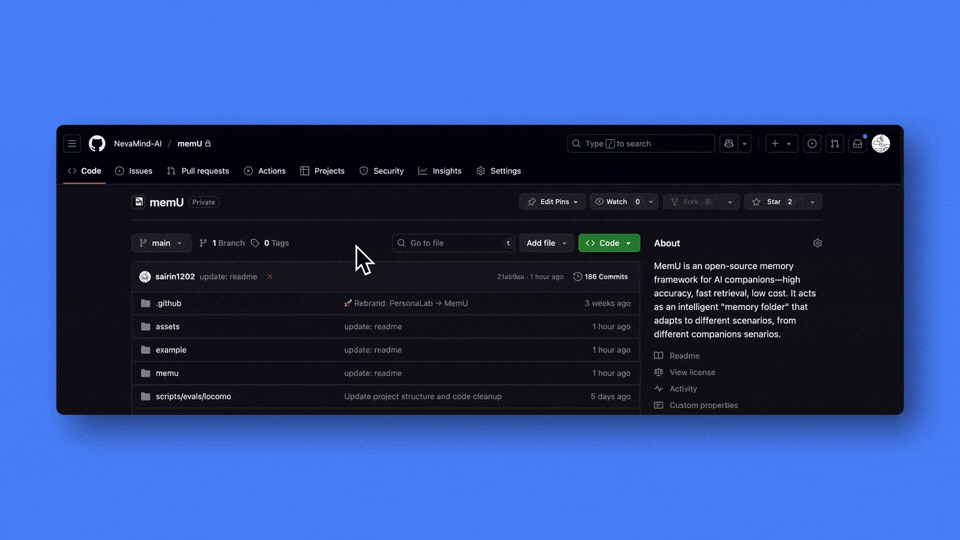

<div align="center">


### MemU：次世代智能代理記憶體系統

[](https://badge.fury.io/py/memu-py)
[](https://opensource.org/licenses/Apache-2.0)
[](https://www.python.org/downloads/)
[](https://discord.gg/memu)
[](https://x.com/memU_ai)
</div>

**MemU** 是一個次世代的智能代理記憶體系統，它從記憶體中心的角度重新設計了代理記憶體架構 — 將其抽象為一個動態演化的資料層，能夠根據上下文智能地組織和檢索相關資訊。通過自適應檢索和回溯機制，它能動態提取最相關的資訊。
該系統採用**統一多模態記憶體**架構，原生支援多種資料類型，包括文字、圖像和音訊，形成一個連貫的記憶體表示。

 訪問我們的首頁：[memu.pro](https://memu.pro/)

---

## ⭐ 在 GitHub 給我們星標

給 MemU 星標，以便收到新版本發布的通知，並加入我們不斷成長的 AI 開發者社群，共同打造具有持久記憶體能力的智能代理。



**💬 加入我們的 Discord 社群:** [https://discord.gg/memu](https://discord.gg/memu)

---

## 🚀 開始使用

有三種方式可以開始使用 MemU：

### ☁️ 雲端版本 ([線上平台](https://app.memu.so))

將您的應用程式與 memU 整合的最快方式。非常適合希望立即存取而無需複雜設定的團隊和個人。我們託管模型、API 和雲端儲存，確保您的應用程式獲得最高品質的 AI 記憶體。

- **即時存取** - 在幾分鐘內開始整合 AI 記憶體
- **託管基礎設施** - 我們處理擴展、更新和維護，以實現最佳記憶體品質
- **優先支援** - 訂閱並獲得我們工程團隊的優先協助

### 逐步指南

**步驟 1:** 建立帳戶

在 https://app.memu.so 建立帳戶。

然後，前往 https://app.memu.so/api-key/ 生成 API 金鑰。

**步驟 2:** 在您的程式碼中加入三行
```python
pip install memu-py

# 使用範例
from memu import MemuClient
```

**步驟 3:** 快速開始
```python
# 初始化
memu_client = MemuClient(
    base_url="https://api.memu.so", 
    api_key=os.getenv("MEMU_API_KEY")
)
memu_client.memorize_conversation(
    conversation=conversation_text, # 建議使用較長的對話 (~8000 tokens)，詳見 https://memu.pro/blog/memu-best-practice
    user_id="user001", 
    user_name="User", 
    agent_id="assistant001", 
    agent_name="Assistant"
)
```
查看 [API 參考](docs/API_REFERENCE.md) 或 [我們的部落格](https://memu.pro/blog) 以獲取更多詳細資訊。

📖 **查看 [`example/client/memory.py`](example/client/memory.py) 以獲取完整的整合細節**

✨ **就是這樣！** MemU 記住所有事情，並幫助您的 AI 從過去的對話中學習。

### 🏢 企業版

適用於需要最高安全性、自訂性、控制力和最佳品質的組織：

- **商業授權** - 完整的專有功能、商業使用權、白標選項
- **客製化開發** - SSO/RBAC 整合、專用演算法團隊針對特定場景進行框架優化
- **智能與分析** - 使用者行為分析、即時生產監控、自動化代理優化
- **優先支援** - 24/7 專屬支援、自訂 SLA、專業實施服務

📧 **企業諮詢:** [contact@nevamind.ai](mailto:contact@nevamind.ai)

### 🏠 自託管 (社群版)
適用於偏好本地控制、資料隱私或自訂的使用者和開發者：

* **資料隱私** - 將敏感資料保留在您的基礎設施內
* **自訂性** - 修改和擴展平台以滿足您的需求
* **成本控制** - 避免大規模部署的重複性雲端費用

請參閱 [自託管 README](README.self_host.md)

---

## ✨ 主要功能

### 🎥 示範影片

<div align="left">
  <a href="https://www.youtube.com/watch?v=qZIuCoLglHs">
    
  </a>
  <br>
  <em>點擊觀看 MemU 示範影片</em>
</div>

---

## 🎓 **使用案例**

| | | | |
|:---:|:---:|:---:|:---:|
| <br>**AI 伴侶** | <br>**AI 角色扮演** | <br>**AI IP 角色** | <br>**AI 教育** |
| <br>**AI 治療** | <br>**AI 機器人** | <br>**AI 創作** | 更多...|

---

## 🤝 貢獻

我們透過開源協作建立信任。您的創意貢獻推動著 memU 的創新向前發展。探索我們的 GitHub issues 和 projects 來開始貢獻，並在 memU 的未來留下您的印記。

📋 **[閱讀我們詳細的貢獻指南 →](CONTRIBUTING.md)**

### **📄 授權**

透過向 MemU 貢獻，您同意您的貢獻將根據 **Apache License 2.0** 進行授權。

---

## 🌍 社群

如需更多資訊，請聯絡 info@nevamind.ai

- **GitHub Issues:** 報告錯誤、請求功能並追蹤開發進度。[提交 issue](https://github.com/NevaMind-AI/memU/issues)

- **Discord:** 獲得即時支援、與社群聊天並保持更新。[加入我們](https://discord.com/invite/hQZntfGsbJ)

- **X (Twitter):** 關注以獲取更新、AI 見解和重要公告。[關注我們](https://x.com/memU_ai)

---

## 🤝 生態系統

我們很榮幸能與出色的組織合作：

<div align="center">

### 開發工具
<a href="https://github.com/TEN-framework/ten-framework"></a>
<a href="https://github.com/openagents-org/openagents"></a>
<a href="https://github.com/camel-ai/camel"></a>
<a href="https://github.com/eigent-ai/eigent"></a>
<a href="https://github.com/milvus-io/milvus"></a>
<a href="https://xroute.ai/"></a>
<a href="https://jaaz.app/"></a>
<a href="https://github.com/Buddie-AI/Buddie"></a>
<a href="https://github.com/bytebase/bytebase"></a>
</div>

---

*有興趣與 MemU 合作嗎？請透過 [contact@nevamind.ai](mailto:contact@nevamind.ai) 聯絡我們*

---

## 📱 加入我們的微信社群

在微信上與我們聯繫，獲取最新更新、社群討論和獨家內容：

<div align="center">


*掃描上方任一 QR code 加入我們的微信社群*

</div>

---

*與 MemU 社群保持聯繫！加入我們的微信群組，進行即時討論、技術支援和建立人脈。*