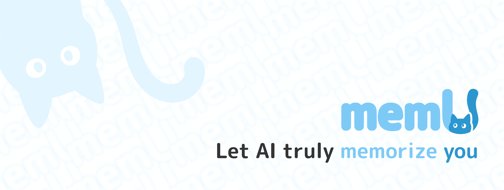

<div align="center">



### MemU: 下一代代理记忆系统

[](https://badge.fury.io/py/memu-py)
[](https://opensource.org/licenses/Apache-2.0)
[](https://www.python.org/downloads/)
[](https://discord.gg/memu)
[](https://x.com/memU_ai)
</div>

**MemU** 是下一代智能体记忆系统，它从以记忆为中心的视角重新设计了智能体记忆架构——将其抽象为一个动态演进的数据层，能够根据上下文智能地组织和检索相关信息。通过自适应检索和回溯机制，它可以动态地提取最相关的信息。
该系统采用 **Unified Multimodal Memory** 架构原生支持多种数据类型，包括文本、图像和音频，形成一个有凝聚力的内存表示。

访问我们的主页: [memu.pro](https://memu.pro/)

---

## ⭐ 在 GitHub 上为我们加星标

关注 MemU 以获取有关新版本的通知，并加入我们不断壮大的 AI 开发者社区，构建具有持久内存功能的智能代理。


**💬 加入我们的 Discord 社区:** [https://discord.gg/memu](https://discord.gg/memu)

---

## 🚀开始使用

有三种方法可以开始使用 MemU:

### ☁️ 云版本 ([Online Platform](https://app.memu.so))

将您的应用程序与 memU 集成的最快方式。非常适合希望立即访问且无需复杂设置的团队和个人。我们托管模型、API 和云存储，确保您的应用程序获得最优质的 AI 内存。

- **Instant Access** - 几分钟内即可开始集成 AI 记忆
- **Managed Infrastructure** - 我们负责扩展、更新和维护，以获得最佳的内存质量
- **Premium Support** - 订阅并获得我们工程团队的优先协助

### 一步一步

**Step 1:** 创建账户

在 https://app.memu.so 创建帐户

然后，转到 https://app.memu.so/api-key/ 生成 api-key。

**Step 2:** 在代码中添加三行
```python
pip install memu-py

# Example usage
from memu import MemuClient
```

**Step 3:** Quick Start
```python
# Initialize
memu_client = MemuClient(
    base_url="https://api.memu.so", 
    api_key=os.getenv("MEMU_API_KEY")
)
memu_client.memorize_conversation(
    conversation=conversation_text, # Recommend longer conversation (~8000 tokens), see https://memu.pro/blog/memu-best-practice for details
    user_id="user001", 
    user_name="User", 
    agent_id="assistant001", 
    agent_name="Assistant"
)
```
查看 [API 参考](docs/API_REFERENCE.md) 或 [我们的博客](https://memu.pro/blog) 了解更多详细信息。 

📖 **查看 [`example/client/memory.py`](example/client/memory.py) 了解完整的集成细节**

✨ **就是这样！** MemU 会记住所有对话，并帮助你的 AI 从过去的对话中学习。

### 🏢 企业版

对于需要最高安全性、定制化、可控性和最佳质量的组织：

- **商业许可** - 完整的专有功能、商业使用权、白标选项
- **定制开发** - SSO/RBAC 集成，专门的算法团队针对特定场景的框架优化
- **智能与分析** - 用户行为分析、实时生产监控、自动化代理优化
- **高级支持** - 全天候专属支持、定制化 SLA、专业实施服务

📧 **企业咨询**：[contact@nevamind.ai](mailto:contact@nevamind.ai)

### 🏠 自托管（社区版）
对于偏好本地控制、数据隐私或定制化的用户和开发者：

* **数据隐私** - 将敏感数据保留在您的基础架构内
* **定制化** - 根据您的需求修改和扩展平台
* **成本控制** - 避免重复的云费用大规模部署

请参阅 [自托管 README](README.self_host.md)

---

## ✨ 主要功能

### 🎥 演示视频

<div align="left">
  <a href="https://www.youtube.com/watch?v=qZIuCoLglHs">
    
  </a>
  <br>
  <em>点击观看MemU演示视频</em>
</div>

---
## 🎓 **用例**

| | | | |
|:---:|:---:|:---:|:---:|
| <br>**AI Companion** | <br>**AI Role Play** | <br>**AI IP Characters** | <br>**AI Education** |
| <br>**AI Therapy** | <br>**AI Robot** | <br>**AI Creation** | More...|
---

## 🤝 贡献

我们通过开源协作建立信任。您的创造性贡献将推动 memU 的创新发展。探索我们的 GitHub 问题和项目，立即开始您的贡献，并在 memU 的未来留下您的印记。

📋 **[阅读我们详细的贡献指南 →](CONTRIBUTING.md)**

### **📄 许可证**

向 MemU 贡献代码，即表示您同意您的贡献将遵循 **Apache 2.0 许可证**。

---

## 🌍 社区
更多信息请联系 info@nevamind.ai

- **GitHub 问题**：报告错误、请求功能并跟踪开发进度。[提交问题](https://github.com/NevaMind-AI/memU/issues)

- **Discord**：获得实时支持、与社区交流并随时掌握最新动态。 [加入我们](https://discord.com/invite/hQZntfGsbJ)

- **X (Twitter)**：关注我们，获取最新资讯、AI 洞察和重要公告。[关注我们](https://x.com/memU_ai)

---

## 🤝 生态系统

我们很荣幸能与以下杰出组织合作：

<div align="center">

### Development Tools
<a href="https://github.com/TEN-framework/ten-framework"></a>
<a href="https://github.com/openagents-org/openagents"></a>
<a href="https://github.com/camel-ai/camel"></a>
<a href="https://github.com/eigent-ai/eigent"></a>
<a href="https://github.com/milvus-io/milvus"></a>
<a href="https://xroute.ai/"></a>
<a href="https://jaaz.app/"></a>
<a href="https://github.com/Buddie-AI/Buddie"></a>
<a href="https://github.com/bytebase/bytebase"></a>
</div>

---

*有兴趣与 MemU 合作吗？请联系我们：[contact@nevamind.ai](mailto:contact@nevamind.ai)*

---

## 📱 加入我们的微信社区

通过微信关注我们，获取最新动态、社区讨论和独家内容：

<div align="center">


*扫描上方任意二维码即可加入我们的微信社区*

</div>

---

*与 MemU 社区保持联系！加入我们的微信群，获取实时讨论、技术支持和交流机会。*
