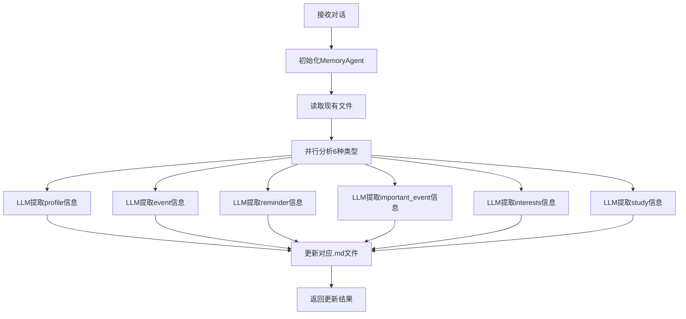

# MemU Server 前后端架构设计

基于新的6种文件类型内存系统的完整前后端架构设计方案。

## 🏗️ 系统架构概览

### 📋 核心特性

- **🔄 混合存储模式**: 支持文件存储 + 数据库存储
- **🤖 智能分析**: LLM驱动的conversation自动分析
- **📁 文件管理**: 6种类型的 `.md` 文件管理
- **🎨 现代UI**: React + Material-UI 响应式设计
- **⚡ 高性能**: FastAPI + PostgreSQL + 文件系统

## 🚀 Backend 架构设计

### 🔧 技术栈

- **框架**: FastAPI 2.0.0
- **数据库**: PostgreSQL + pgvector (向量搜索)
- **文件存储**: Markdown文件系统
- **LLM集成**: OpenAI / Azure OpenAI
- **认证**: CORS + 环境变量配置

### 📡 API 端点设计

#### **1. 核心系统端点**

```
GET  /                          # 健康检查
GET  /api/stats                 # 系统统计（包含文件存储统计）
GET  /api/storage/modes         # 存储模式选择
```

#### **2. 文件内存管理端点** (新增)

```
# 角色管理
GET    /api/file-memory/characters                    # 获取角色列表
GET    /api/file-memory/characters/{name}/summary     # 角色详情摘要
DELETE /api/file-memory/characters/{name}            # 清除角色所有文件

# 文件操作
GET    /api/file-memory/characters/{name}/files/{type}            # 读取文件内容
PUT    /api/file-memory/characters/{name}/files/{type}            # 更新文件内容
GET    /api/file-memory/characters/{name}/files/{type}/download   # 下载文件

# 对话分析
POST   /api/file-memory/analyze-conversation          # 分析对话并更新所有文件类型

# 批量操作
POST   /api/file-memory/bulk-operations              # 批量清理/导出

# 系统信息
GET    /api/file-memory/system/info                  # 文件系统信息
```

#### **3. 数据库内存端点** (保留原有)

```
GET    /api/conversations       # 对话列表
GET    /api/memories            # 内存列表
POST   /api/memories/update-memory  # 更新内存(数据库模式)
...
```

### 🗂️ 数据模型

#### **文件内存相关模型**

```python
class MemoryFileInfo(BaseModel):
    character_name: str
    memory_type: str            # profile, event, reminder, important_event, interests, study
    has_content: bool
    file_size: int
    last_modified: Optional[str]
    content_preview: Optional[str]

class ConversationAnalysisRequest(BaseModel):
    character_name: str
    conversation: str
    session_date: Optional[str]

class ConversationAnalysisResponse(BaseModel):
    success: bool
    files_updated: Dict[str, bool]  # 每种文件类型的更新状态
    new_content: Dict[str, str]     # 提取的新内容
```

### 🔄 核心处理流程

#### **对话分析流程**



## 🎨 Frontend 架构设计

### 🔧 技术栈

- **框架**: React 18 + Vite
- **UI库**: Material-UI (MUI)
- **路由**: React Router v6
- **状态管理**: React Hooks
- **HTTP客户端**: Axios

### 📱 页面结构设计

#### **1. 文件内存管理页面** (新增)

**`/file-memories`** - 主管理页面
- 角色列表展示
- 文件类型概览卡片
- 系统状态信息
- 对话分析入口

**`/file-memory/{character}/{type}`** - 文件详情页面
- 文件内容查看/编辑
- 下载/复制功能
- 文件统计信息
- 版本历史跟踪

#### **2. 原有页面** (保留增强)

**`/dashboard`** - 控制面板
- 添加文件存储统计
- 存储模式切换
- 系统健康状态

**`/conversations`** - 对话管理
**`/memories`** - 数据库内存管理

### 🎯 用户体验设计

#### **直观的文件类型展示**

```jsx
const MEMORY_TYPES = {
  profile: { icon: ProfileIcon, color: '#3b82f6', label: 'Profile' },
  event: { icon: EventIcon, color: '#10b981', label: 'Events' },
  reminder: { icon: ReminderIcon, color: '#f59e0b', label: 'Reminders' },
  important_event: { icon: ImportantIcon, color: '#ef4444', label: 'Important Events' },
  interests: { icon: InterestsIcon, color: '#8b5cf6', label: 'Interests' },
  study: { icon: StudyIcon, color: '#06b6d4', label: 'Study' }
}
```

#### **智能对话分析界面**

- 角色选择/新建
- 对话内容输入
- 实时分析进度
- 结果展示和文件更新状态

## 📁 文件系统设计

### 🗃️ 目录结构

```
memory/                          # 内存文件根目录
├── alice_profile.md            # 角色档案
├── alice_event.md             # 事件记录
├── alice_reminder.md          # 提醒事项
├── alice_important_event.md   # 重要事件
├── alice_interests.md         # 兴趣爱好
├── alice_study.md             # 学习信息
├── bob_profile.md
├── bob_event.md
└── ...
```

### 📄 文件格式标准

**示例: `alice_reminder.md`**
```markdown
- Submit Q1 performance review by March 15th
- Schedule dentist appointment for next month
- Buy birthday gift for mom (birthday is March 10th)
- Finish reading "Clean Code" book
- Update LinkedIn profile with new skills
```

**示例: `alice_interests.md`**
```markdown
## Technology & Learning
- Machine Learning and AI research
- Cloud computing (AWS, Azure)
- Open source contribution (GitHub projects)

## Outdoor Activities
- Hiking in Bay Area trails
- Rock climbing (indoor and outdoor)
- Photography (nature and landscape)
```

## 🔧 部署和配置

### 🚀 启动配置

#### **Backend启动**

```bash
cd server/backend
# 设置环境变量
export MEMORY_DIR="./memory"
export OPENAI_API_KEY="your-key"
export POSTGRES_HOST="localhost"

# 启动服务
python main_updated.py
```

#### **Frontend启动**

```bash
cd server/frontend
npm install
npm run dev
```

### ⚙️ 环境变量配置

```env
# LLM配置
OPENAI_API_KEY=sk-...
AZURE_OPENAI_API_KEY=...

# 文件存储配置
MEMORY_DIR=memory
MEMORY_BACKUP_DIR=memory_backup

# 数据库配置
POSTGRES_HOST=localhost
POSTGRES_PORT=5432
POSTGRES_DB=memu
POSTGRES_USER=chenhong
POSTGRES_PASSWORD=
```

## 💡 核心优势

### ✅ **文件存储优势**

- **人类可读**: Markdown格式，易于理解和编辑
- **版本控制**: 支持Git版本管理
- **便携性**: 文件可以轻易备份和迁移
- **透明性**: 内容完全可见，无黑盒操作
- **结构化**: 6种类型清晰分类

### ✅ **混合架构优势**

- **灵活选择**: 根据需求选择存储方式
- **无缝切换**: 数据库和文件存储可以并存
- **扩展性**: 支持未来新的存储后端
- **兼容性**: 保持与现有系统的完全兼容

### ✅ **智能分析优势**

- **自动提取**: 一次对话，更新所有相关文件
- **精准分类**: 基于LLM的智能信息分类
- **增量更新**: 只添加新信息，避免重复
- **上下文理解**: 理解对话语义和时间关系

## 🔮 未来扩展

### 🎯 计划中的功能

1. **文件版本管理**: Git集成和历史版本查看
2. **协作编辑**: 多用户同时编辑文件
3. **模板系统**: 预定义的文件模板
4. **导入导出**: 批量导入导出功能
5. **搜索增强**: 跨文件全文搜索
6. **可视化**: 角色信息的图形化展示

### 🔄 技术演进

- **实时同步**: WebSocket实时更新
- **离线支持**: PWA离线编辑能力
- **移动适配**: 移动设备专用UI
- **AI增强**: 更智能的内容建议和补全

## 📊 性能和监控

### 📈 关键指标

- **文件操作响应时间**: < 100ms
- **对话分析处理时间**: < 30s
- **并发用户支持**: 100+
- **文件存储限制**: 单文件 < 10MB

### 🔍 监控要点

- 文件系统I/O性能
- LLM API调用延迟
- 内存使用情况
- 错误率和异常监控

---

这个架构设计提供了一个完整的、可扩展的文件存储内存管理系统，既保持了与现有数据库系统的兼容性，又引入了强大的文件管理和智能分析能力。 