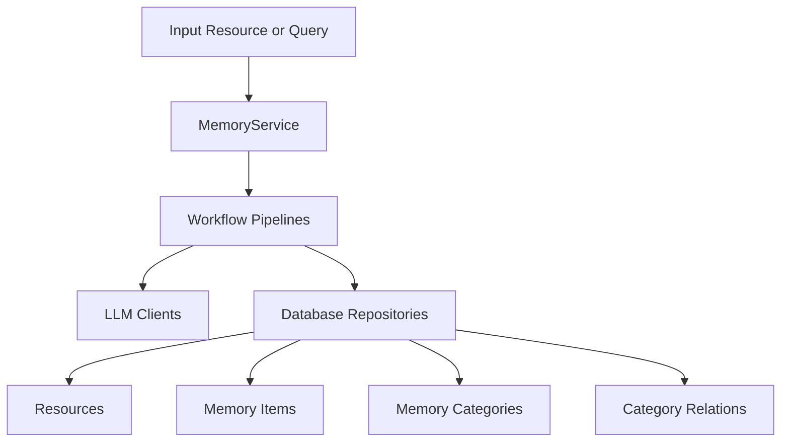
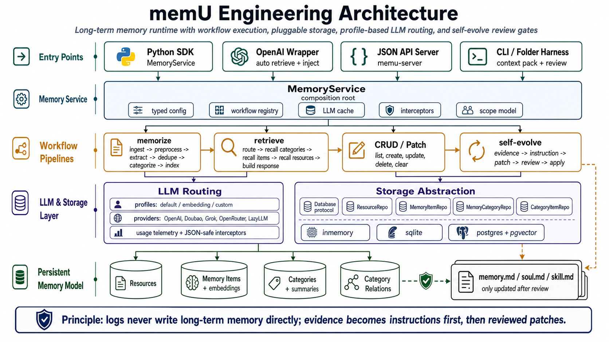
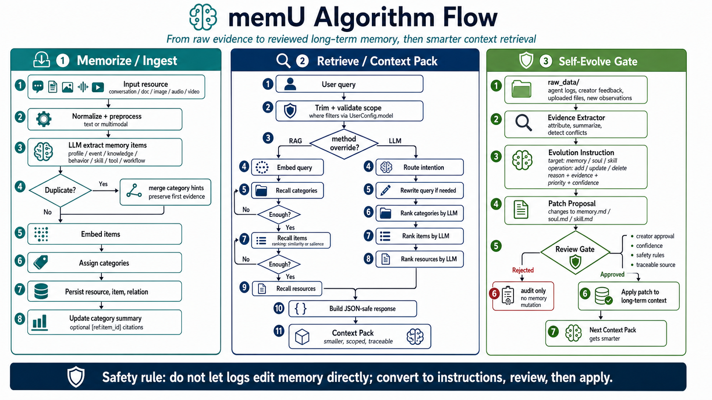
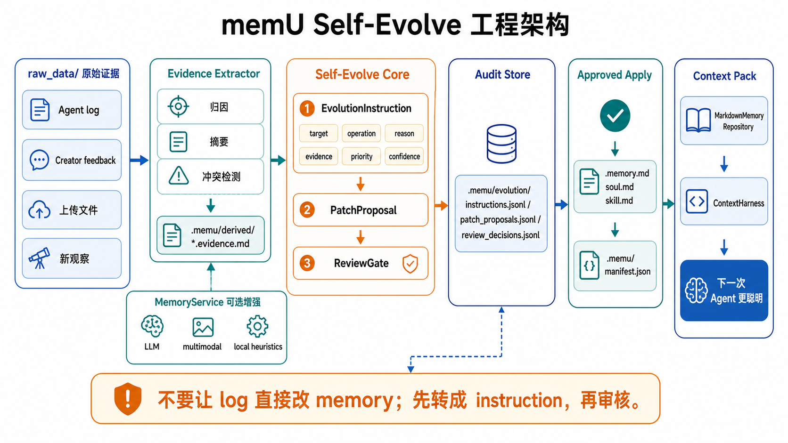
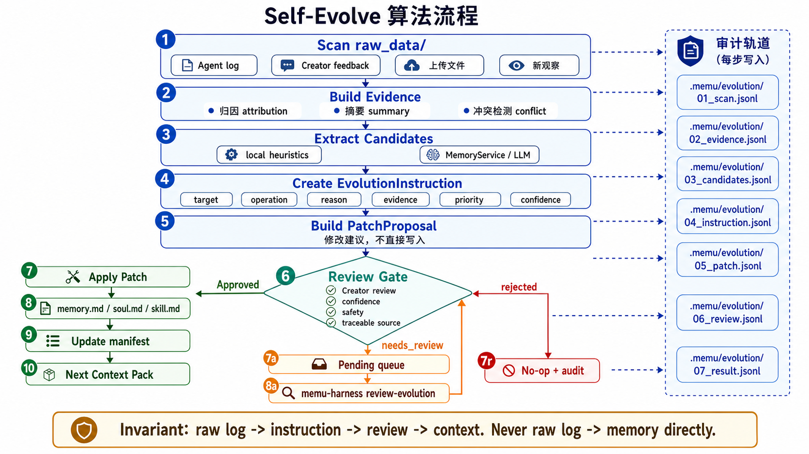

# memU Architecture

## Purpose and scope

This document describes the self-hosted `memu` Python package architecture as implemented in this repository.

The repository also describes a hosted Cloud product in `README.md`, but this document focuses on the local `MemoryService` runtime and its code paths.

## System overview

memU follows the "memory as file system" concept from the README and implements it with three persistent layers:

- `Resource`: raw source artifacts (conversation/document/image/video/audio)
- `MemoryItem`: extracted atomic memories with embeddings
- `MemoryCategory`: grouped topic summaries
- `CategoryItem`: item-category relation edges

At runtime, `MemoryService` orchestrates ingestion, retrieval, and manual CRUD over these layers.


```mermaid
flowchart TD
  A["Input Resource or Query"] --> B["MemoryService"]
  B --> C["Workflow Pipelines"]
  C --> D["LLM Clients"]
  C --> E["Database Repositories"]
  E --> F["Resources"]
  E --> G["Memory Items"]
  E --> H["Memory Categories"]
  E --> I["Category Relations"]
```





## Core runtime components

### `MemoryService` as composition root

`src/memu/app/service.py` constructs and owns:

- typed configs (`LLMProfilesConfig`, `DatabaseConfig`, `MemorizeConfig`, `RetrieveConfig`, `UserConfig`)
- storage backend (`build_database(...)`)
- resource filesystem fetcher (`LocalFS`)
- LLM client cache and wrappers
- workflow and LLM interceptor registries
- workflow runner (`local` by default, pluggable)
- named workflow pipelines via `PipelineManager`

Public APIs are assembled by mixins:

- `MemorizeMixin`: `memorize(...)`
- `RetrieveMixin`: `retrieve(...)`
- `CRUDMixin`: list/clear/create/update/delete memory operations

LLM profile configs validate provider choices and embedding batch boundaries up front; `embed_batch_size` must be a
positive integer before SDK clients are constructed.
Retrieve breadth settings (`top_k`) and category-summary target lengths are positive integers, salience recency
decay must be positive, and category assignment thresholds are constrained to `[0, 1]`.

### Workflow engine

All major operations execute as workflows (`WorkflowStep`) with:

- explicit required/produced state keys
- declared capability tags (`llm`, `vector`, `db`, `io`, `vision`)
- per-step config (for profile selection)

`PipelineManager` validates step dependencies and LLM profile references at registration/mutation time. Profile
references must be non-empty strings and must resolve to a configured profile. It also supports runtime pipeline
revisioning (`config_step`, `insert_before/after`, `replace_step`, `remove_step`).

`WorkflowRunner` is a protocol; default `LocalWorkflowRunner` executes sequentially with `run_steps(...)`.

### Interception and observability hooks

Two interceptor systems exist:

- workflow step interceptors: before/after/on_error around each step
- LLM call interceptors: before/after/on_error around `chat/summarize/vision/embed/transcribe`

LLM wrappers also extract best-effort usage metadata from raw provider responses. They normalize both
chat-completions-style token names (`prompt_tokens`/`completion_tokens`) and responses-style token names
(`input_tokens`/`output_tokens`) into `LLMUsage`. Extracted usage and token breakdowns are normalized into
JSON-safe values before interceptors receive them, so logging, audit trails, and external telemetry sinks can
persist the observation without SDK-specific objects leaking through. Batched embedding calls may return multiple
raw provider responses; the wrapper aggregates their token usage so cost telemetry covers the whole batch.

## Ingestion architecture (`memorize`)

`memorize(...)` executes the `memorize` pipeline:

1. `ingest_resource`: fetch local/remote resource into `blob_config.resources_dir` via `LocalFS`
2. `preprocess_multimodal`: modality-specific preprocessing for conversation/document/audio (text-oriented path) and image/video (vision-oriented path)
3. `extract_items`: per-memory-type LLM extraction into structured entries
4. `dedupe_merge`: remove duplicate extracted entries within the current batch, preserving first-seen order and merging category hints
5. `categorize_items`: persist resource + memory items + item-category relations and embeddings
6. `persist_index`: update category summaries; optionally persist item references
7. `build_response`: return resource(s), items, categories, relations

Category bootstrap is lazy and scoped: categories are initialized when needed with embeddings, and mapped by normalized category name.

## Retrieval architecture (`retrieve`)

`retrieve(...)` chooses one of two pipelines from `retrieve_config.method`, unless a request passes a per-call `method` override:

- `retrieve_rag` (embedding-driven ranking)
- `retrieve_llm` (LLM-driven ranking)

RAG item ranking also supports a per-call `ranking` override (`similarity` or `salience`), defaulting to
`retrieve_config.item.ranking`.

Both use the same staged pattern:

1. route intention + optional query rewrite
2. category recall
3. sufficiency check (optional)
4. item recall
5. sufficiency check (optional)
6. resource recall
7. response build

Key behavior:

- `where` filters are validated against `user_model` fields and field value types before querying; supported filters are equality (`field`) and membership (`field__in`)
- category, item, and resource retrieval toggles apply consistently to both `rag` and `llm` retrieve pipelines
- RAG path uses vector similarity (and optional salience ranking for items)
- LLM path ranks IDs from formatted category/item/resource context
- when category references are enabled, both RAG and LLM paths use scoped `ref_id`
  lookups to follow `[ref:...]` citations from category summaries back to memory items
- Python retrieve accepts a non-empty `queries` list containing string query items or `{role, content}` message objects; HTTP retrieve accepts the same list shape plus a shorthand `query` string. Both paths normalize every query item, trim query text, and reject blank query items before workflow execution
- each stage can stop early if sufficiency check decides context is enough
- public response records are JSON-safe and omit raw embedding vectors by default

## Data and storage architecture

### Repository contracts

Storage is abstracted through a `Database` protocol with four repositories:

- `ResourceRepo`
- `MemoryItemRepo`
- `MemoryCategoryRepo`
- `CategoryItemRepo`

### Backends

`build_database(...)` selects backend by `database_config.metadata_store.provider`:

- `inmemory`: in-process dict/list state
- `sqlite`: SQLModel persistence, embeddings stored as JSON text, brute-force cosine search
- `postgres`: SQLModel persistence with pgvector support (when enabled), local fallback ranking when needed

In-memory repositories mutate shared `InMemoryState` containers in place so the store-level
`resources`, `items`, `categories`, and `relations` views stay consistent after scoped clears.

For Postgres, startup runs migration bootstrap and attempts
`CREATE EXTENSION IF NOT EXISTS vector` in `ddl_mode="create"`.
When Postgres retrieval falls back to local ranking, including salience-aware
ranking, it queries current memory-item rows for the requested scope before
scoring so persisted memories remain visible after restarts and external writes.
Postgres clear/delete paths also prune in-process item and relation caches after
database cascade deletes, preventing later repository calls from reusing stale
relation edges.

### Scope model propagation

`UserConfig.model` is merged into record/table models so scope fields (for example `user_id`)
become first-class columns/attributes across resources, items, categories, and relations.
Backend-agnostic record models also preserve scope fields as extra attributes when adapters
materialize cached or response records from scoped storage rows.

This is why `where` filters and `user_data` writes are consistently available across APIs.
Scope filter values are normalized through `UserConfig.model`, so backend queries see the same
typed values that writes use. This validation is field-level, so partial filters do not need to
provide every field required by a custom user model.
Default category bootstrap and the in-process category ID/name map are cached per concrete user
scope, so one user's category IDs are not reused for another user's writes.
Persistent SQLite/Postgres category tables enforce category-name uniqueness per configured scope.
ID-based update/delete operations also verify the target memory item against the provided user
scope before mutation, treating cross-scope IDs as not found.
First-run category listing and category-enabled retrieval initialize default categories when `where`
identifies one concrete scope; multi-scope filters such as `field__in` do not create categories implicitly.
Manual `create_memory_item` writes source-less memory items with `resource_id=None`; `memorize`
remains the resource-backed ingestion path.
For manual `update_memory_item`, omitted `memory_categories` preserves existing category links,
while an explicit empty list clears them.
Manual create/update/delete inputs trim IDs, memory types, content, and category names, and reject
blank IDs, invalid memory types, blank content, or blank category names before entering workflow execution.
`MemoryItem.extra` is a per-record metadata dictionary created with a default factory, so tool-memory
and reinforcement metadata cannot leak between records.
Tool call history stored in `extra.tool_calls` is dumped in JSON mode so timestamps remain
portable across in-memory, SQLite, Postgres, HTTP responses, and exported artifacts.
Scoped `clear_memory` deletes category-item relation edges before categories, items,
and resources so no backend can leave dangling in-memory or persistent relations behind.
Single-item `delete_memory_item` follows the same rule by clearing relation edges for the target
item before deleting the item record.

## LLM/provider architecture

LLM access is profile-based (`llm_profiles`):

- `default` profile for chat-like tasks
- `embedding` profile for embedding tasks (auto-derived from default if not set)

Profile names are whitespace-trimmed and must be non-empty.
Per-step profile routing happens through step config (`chat_llm_profile`, `embed_llm_profile`, or `llm_profile`).
Retrieve workflows expose separate profiles for route intention, sufficiency checks, and LLM ranking, so callers can
split cheap routing from heavier ranking models without changing pipeline code.

Client backends:

- `sdk`: official OpenAI SDK wrapper
- `httpx`: provider-adapted HTTP backend (OpenAI, Doubao, Grok, OpenRouter)
- `lazyllm_backend`: optional LazyLLM adapter, installed with the `lazyllm` extra

## Integration surfaces

- `memu.client.openai_wrapper`: opt-in OpenAI client wrapper that auto-retrieves memories and injects them into
  system context. Its `ranking` parameter is passed through as a per-call retrieve ranking override, and `top_k`
  must be a positive integer and caps injected memory items. Wrapper user scope is copied at construction time so
  caller-owned `user_data` dictionaries cannot mutate active retrieve scope accidentally.
- `memu.integrations.langgraph`: LangChain/LangGraph tool adapter (`save_memory`, `search_memory`).
  Its explicit `user_id` scope is authoritative and cannot be overridden by metadata filters.
- `memu.server`: built-in self-hosted JSON API server. The console command
  `memu-server` wraps `MemoryService` with standard-library HTTP endpoints for
  health, memorize, retrieve, category/item listing, manual item create/update/delete,
  scoped clear operations, and a public `/openapi.json` contract. Its environment
  loader wires LLM profiles, metadata storage, and vector index settings into
  the same `MemoryService` composition root used by library callers.

## Markdown-backed folder compiler

`memu.app.folder.FolderMemoryCompiler` adds a file-system harness layer for compiling an uploaded folder into a portable Markdown memory repository:



- `raw_data/`: synchronized copy of the uploaded folder, including text, images, audio, video, documents, code, and unknown binary files
- `.memu/harness.json`: repository-local CLI defaults for compiler and context behavior
- `.memu/manifest.json`: source hash index used for incremental re-extraction and removal of deleted-source memories
- `.memu/derived/`: per-source evidence Markdown for text evidence or multimodal metadata evidence
- `.memu/evolution/`: append-only audit records for Evolution Instructions, Patch Proposals, and review decisions
- `AGENTS.md`: non-overwriting bootstrap instructions for local agents using the harness repository
- `memory.md` and `memory/`: durable facts, preferences, events, and knowledge
- `soul.md` and `soul/`: persona, tone, voice, language style, and interaction-style signals
- `skill.md` and `skill/`: skills, workflows, tool-use patterns, procedures, and reusable capabilities

The compiler can run with local deterministic extraction so the Markdown
repository is always buildable. When a configured `MemoryService` is supplied,
it delegates richer extraction to the existing `memorize` workflow, appends
returned captions/items/categories to the derived evidence file, and turns
extracted candidates into reviewed long-term-context patches.

Self-evolve has a hard ownership boundary: raw logs, creator feedback, uploads,
and new observations never edit `memory.md`, `soul.md`, or `skill.md` directly.
The compiler first creates structured `EvolutionInstruction` records containing
`target`, `operation`, `reason`, `evidence`, `priority`, and `confidence`. Each
instruction becomes a `PatchProposal`; the review gate then approves, rejects,
or marks the proposal as `needs_review` based on traceable evidence,
confidence, conflict detection, and safety checks. Only approved proposals are
applied to the generated Markdown blocks and manifest entries.



Incremental compiles keep generated artifacts aligned with the manifest:
deleted sources create reviewed delete proposals that remove generated entries,
stale raw-data copies, and stale `.memu/derived/**/*.evidence.md` files only
after approval. Health checks warn about orphaned
derived evidence that is not referenced by the manifest. Callers can provide
explicit source-relative exclude globs to skip noisy caches or build artifacts;
memU does not apply default excludes. The same patterns can be persisted in a
source or repository `.memuignore` file.

The unified harness CLI and standalone `memu-context` command can read
`.memu/harness.json` for repository-local defaults such as compiler exclude
globs, `max_text_chars`, context output format, total context budget, selected
buckets, and per-bucket context budgets. Command-line arguments override the
config file. LLM provider, API key, and user-scope settings remain
command/environment driven instead of being stored in the repository config.

For local multimodal extraction without an LLM, the compiler also reads
sidecar files beside media, document, and unknown binary sources, such as
`image.caption.md`, `image.metadata.json`, `audio.transcript.txt`,
`video.frames.jsonl`, or `report.summary.md`, and appends that sidecar content
to the paired source's derived evidence. Sidecars are included in the paired
source fingerprint, so updating a caption, transcript, summary, OCR output, or
metadata file triggers re-extraction of that source.

The installed CLI command `memu-folder` exposes this flow for tool use:

```bash
memu-folder path/to/raw-folder path/to/memory-repo
memu-folder path/to/raw-folder path/to/memory-repo --watch
```

`memu.app.markdown_context.MarkdownMemoryRepository` reads the generated
Markdown repository back into a context harness. It loads generated entries from
`.memu/manifest.json`, preserves human notes outside generated blocks, ranks
sections with lightweight query matching, and emits an agent-ready
`<memu_context>` pack, system prompt, chat message list, or lightweight summary
index. Context assembly can also apply per-bucket character limits so `memory`,
`soul`, and `skill` sections share a predictable context budget. Promoted skill
index snippets in `skill.md` are skipped when their full `skill/promoted/*.md`
cards are present, avoiding duplicate manual skill context. CLI context output
can be printed or written to a file for downstream agents and scripts. The
installed CLI command `memu-context` exposes this path:

```bash
memu-context path/to/memory-repo --query "current task"
memu-context path/to/memory-repo --query "current task" --format summary
memu-context path/to/memory-repo --query "current task" --format messages
memu-context path/to/memory-repo --bucket-max soul=1000 --bucket-max skill=2000
memu-context path/to/memory-repo --format system --output context.system.md
```

`memu.app.skill_trace.record_skill_trace` records agent execution traces under
`raw_data/skill_traces/`. These traces are raw evidence for self-evolving
skills: the normal folder compiler or watch mode converts them into Evolution
Instructions and Patch Proposals before any approved update reaches `skill.md`
or `skill/`. `suggest_skill_promotions` groups trace lessons, actions, tools,
and outcomes into deterministic promotion candidates. Suggestions are read-only
until the caller explicitly promotes them into durable manual skills.

`memu.app.context_harness.ContextHarness` is the high-level composition layer
for this Markdown-backed mode. It binds a user raw-data folder to a memory
repository and exposes one-object methods for:

- `ingest`: compile changed raw data through self-evolve review into Markdown memory
- `scaffold`: create the Markdown repository layout before extraction
- `status`: inspect source changes against the manifest without writing files
- `health`: validate repository layout, manifest references, and generated blocks
- `suggest_skills`: propose durable skill promotions from raw traces
- `promote_skill`: append durable manual skill notes and update stable skill cards
- `refresh_context`: compile, then assemble an agent-ready context pack
- `record_skill_trace`: persist execution lessons under raw data and optionally recompile
- `watch`: poll the raw-data folder and recompile on source changes

For an already initialized repository, `ContextHarness.from_repo(repo_dir)` uses
`repo/raw_data` as the source and applies `.memu/harness.json` compiler and
context defaults unless explicit Python arguments override them.

The installed CLI command `memu-harness` exposes the same composition layer:

```bash
memu-harness init path/to/memory-repo --source-folder path/to/raw-folder
memu-harness doctor path/to/memory-repo --json
memu-harness status path/to/memory-repo --json
memu-harness refresh path/to/memory-repo --query "current task"
memu-harness review-evolution path/to/memory-repo
memu-harness trace path/to/memory-repo --task "What changed?"
memu-harness suggest-skills path/to/memory-repo --json
memu-harness promote-skill path/to/memory-repo --title "Reusable workflow"
```

## Current constraints and tradeoffs

- workflow state is dict-based, so step contracts are validated by key names rather than static types
- SQLite/inmemory vector search is brute-force (portable but less scalable)
- category update quality and extraction quality are prompt/LLM dependent
- deeper semantic merge policies can still be added on top of the current deterministic dedupe stage

## Related ADRs

- `docs/adr/0001-workflow-pipeline-architecture.md`
- `docs/adr/0002-pluggable-storage-and-vector-strategy.md`
- `docs/adr/0003-user-scope-in-data-model.md`
- `docs/adr/0004-markdown-context-harness-and-skill-evolution.md`
- `docs/adr/0005-self-evolve-instruction-review-gate.md`
