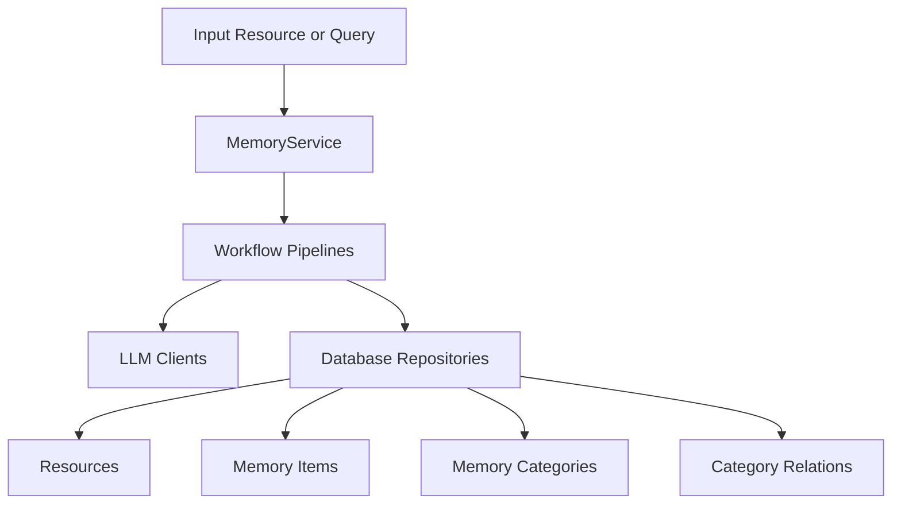

# memU Architecture

## Purpose and scope

This document describes the self-hosted `memu` Python package architecture as implemented in this repository.

The repository also describes a hosted Cloud product in `README.md`, but this document focuses on the local `MemoryService` runtime and its code paths.

## System overview

memU implements structured agent memory with four persistent record types:

- `Resource`: raw source artifacts (conversation/document/image/video/audio)
- `MemoryItem`: extracted atomic memories with embeddings
- `MemoryCategory`: grouped topic summaries
- `CategoryItem`: item-category relation edges

At runtime, `MemoryService` orchestrates ingestion, retrieval, and manual CRUD over these layers.


```mermaid
flowchart TD
  A["Input Resource or Query"] --> B["MemoryService"]
  B --> C["Workflow Pipelines"]
  C --> D["LLM Clients"]
  C --> E["Database Repositories"]
  E --> F["Resources"]
  E --> G["Memory Items"]
  E --> H["Memory Categories"]
  E --> I["Category Relations"]
```

## Core runtime components

### `MemoryService` as composition root

`src/memu/app/service.py` constructs and owns:

- typed configs (`LLMProfilesConfig`, `DatabaseConfig`, `MemorizeConfig`, `RetrieveConfig`, `UserConfig`)
- storage backend (`build_database(...)`)
- resource filesystem fetcher (`LocalFS`)
- LLM client cache and wrappers
- workflow and LLM interceptor registries
- workflow runner (`local` by default, pluggable)
- named workflow pipelines via `PipelineManager`

Public APIs are assembled by mixins:

- `MemorizeMixin`: `memorize(...)`
- `RetrieveMixin`: `retrieve(...)`
- `CRUDMixin`: list/clear/create/update/delete memory operations

### Workflow engine

All major operations execute as workflows (`WorkflowStep`) with:

- explicit required/produced state keys
- declared capability tags (`llm`, `vector`, `db`, `io`, `vision`)
- per-step config (for profile selection)

`PipelineManager` validates step dependencies at registration/mutation time and supports runtime pipeline revisioning (`config_step`, `insert_before/after`, `replace_step`, `remove_step`).

`WorkflowRunner` is a protocol; default `LocalWorkflowRunner` executes sequentially with `run_steps(...)`.

### Interception and observability hooks

Two interceptor systems exist:

- workflow step interceptors: before/after/on_error around each step
- LLM call interceptors: before/after/on_error around `chat/summarize/vision/embed/transcribe`

LLM wrappers also extract best-effort usage metadata from raw provider responses.

## Ingestion architecture (`memorize`)

`memorize(folder=..., user=...)` ingests a **folder** and incrementally syncs it
into memory using an input-side manifest. Each call:

1. Recursively scans `folder`, inferring each file's modality from its extension
   (`.json` → conversation, `.txt/.md` → document, image/video/audio by
   extension). Unsupported extensions are skipped (and logged); hidden files and
   the manifest itself are ignored.
2. Loads the sidecar `<folder>/.memu_manifest.json` (`relative path -> content
   hash`) and diffs it against the scan to compute **added / modified / deleted**.
3. For modified + deleted files: cascade-deletes the prior `Resource` together
   with its `MemoryItem`s and item-category relations, then recomputes the
   affected category summaries (discarded content fed in as `(before, None)`).
4. For added + modified files: runs the per-file `memorize` pipeline below to
   (re)extract memory. One input file maps to exactly one `Resource`.
5. Refreshes the memory file tree (`memory_fs`): a full rebuild when anything was
   modified/deleted, an incremental update for pure additions.
6. Rewrites the manifest, and returns a sync summary (`added`, `modified`,
   `deleted`, `resources`, `removed_resources`, `items`).

The per-file pipeline (`_memorize_one`) executes the `memorize` workflow:

1. `ingest_resource`: fetch local/remote resource into `blob_config.resources_dir` via `LocalFS`
2. `preprocess_multimodal`: modality-specific preprocessing for conversation/document/audio (text-oriented path) and image/video (vision-oriented path)
3. `extract_items`: per-memory-type LLM extraction into structured entries. Conversation segments are an internal extraction detail only — all segment entries/captions are aggregated into a single resource plan.
4. `dedupe_merge`: placeholder stage (currently pass-through)
5. `categorize_items`: persist resource + memory items + item-category relations and embeddings
6. `persist_index`: update category summaries; optionally persist item references
7. `build_response`: return resource, items, categories, relations

Category bootstrap is lazy and scoped: categories are initialized when needed with embeddings, and mapped by normalized category name.

> The input manifest is keyed by folder (and is user-agnostic): a given folder is
> expected to be synced for a single user scope.

## Retrieval architecture (`retrieve`)

`retrieve(...)` chooses one of two pipelines from config:

- `retrieve_rag` (embedding-driven ranking)
- `retrieve_llm` (LLM-driven ranking)

Both use the same staged pattern:

1. route intention + optional query rewrite
2. category recall
3. sufficiency check (optional)
4. item recall
5. sufficiency check (optional)
6. resource recall
7. response build

Key behavior:

- `where` filters are validated against `user_model` fields before querying
- RAG path uses vector similarity (and optional salience ranking for items)
- LLM path ranks IDs from formatted category/item/resource context
- each stage can stop early if sufficiency check decides context is enough

## Data and storage architecture

### Repository contracts

Storage is abstracted through a `Database` protocol with four repositories:

- `ResourceRepo`
- `MemoryItemRepo`
- `MemoryCategoryRepo`
- `CategoryItemRepo`

All record access goes through these repositories, which enforce scope (`where`)
filtering. The `Database` protocol intentionally does **not** expose the raw
in-process record stores, so business logic cannot bypass scope rules.

### Backends

`build_database(...)` selects backend by `database_config.metadata_store.provider`:

- `inmemory`: in-process dict/list state
- `sqlite`: SQLModel persistence, embeddings stored as JSON text, brute-force cosine search
- `postgres`: SQLModel persistence with pgvector support (when enabled), local fallback ranking when needed

For Postgres, startup runs migration bootstrap and attempts `CREATE EXTENSION IF NOT EXISTS vector` in `ddl_mode="create"`.

### Scope model propagation

`UserConfig.model` is merged into record/table models so scope fields (for example `user_id`) become first-class columns/attributes across resources, items, categories, and relations.

This is why `where` filters and `user_data` writes are consistently available across APIs.

## LLM/provider architecture

LLM access is profile-based (`llm_profiles`):

- `default` profile for chat-like tasks
- `embedding` profile for embedding tasks (auto-derived from default if not set)

Per-step profile routing happens through step config (`chat_llm_profile`, `embed_llm_profile`, or `llm_profile`).

Chat and embedding are decoupled concerns with separate client implementations
and separate per-profile caches in `MemoryService`:

- chat-like clients (`chat`/`summarize`/`vision`/`transcribe`) live in `memu.llm`
- embedding clients live in `memu.embedding` and are used for all vectorization
  (the embedding profile is resolved to an embedding client, then wrapped by the
  same `LLMClientWrapper` for observability)

Client backends (apply to both chat and embedding clients):

- `sdk`: official OpenAI SDK wrapper
- `httpx`: provider-adapted HTTP backend (OpenAI, Doubao, Grok, OpenRouter)
- `lazyllm_backend`: LazyLLM adapter (a single unified client that also serves
  embedding, since LazyLLM has no standalone embedding client)

## Integration surfaces

- `memu.client.openai_wrapper`: opt-in OpenAI client wrapper that auto-retrieves memories and injects them into system context
- `memu.integrations.langgraph`: LangChain/LangGraph tool adapter (`save_memory`, `search_memory`)

## Memory file system export (`memu.memory_fs`)

`MemoryService.export_memory_files(...)` renders the structured store into the
markdown tree described in the README:

```txt
<output_dir>/
├── INDEX.md                     ← index of the raw files under resource/
├── MEMORY.md                    ← overall overview + index of memory/
├── SKILL.md                     ← index of the skills under skill/
├── resource/
│   └── <file_name>              ← one copied raw source file
├── memory/
│   └── <slug>.md                ← one memory category (description + summary)
└── skill/
    └── <skill_name>/SKILL.md    ← one extracted skill profile per folder
```

- `resource/` holds the raw source files copied verbatim out of the blob store
  (`Resource.local_path`), so the ingested bytes live next to the memory.
- `INDEX.md` is an index of those raw files: for each in-scope `Resource` it lists
  the file name, modality, multimodal description, and a link into `resource/`
  (resources without a readable `local_path` are listed without a link). It does
  not list folders or skills.
- `memory/` splits the living memory one file per `MemoryCategory`
  (`memory/<slug>.md`), each holding the category's description and summary
  (profile, preferences, goals, events).
- `MEMORY.md` opens with a deterministic `## Overview` of the `MemoryCategory`
  structure, where each entry links to its `memory/<slug>.md` file.
- `SKILL.md` (root) is a generated index/table of contents over the `skill/`
  tree: one line per skill with its slug, one-line description, and a link to
  `skill/<name>/SKILL.md`.
- `skill/<name>/SKILL.md` is one `skill`-type `MemoryItem` extracted during
  memorize. Each item's summary is a comprehensive skill profile (Markdown with
  `name`/`description` frontmatter, produced by `memu.prompts.memory_type.skill`
  from logs / workflow traces / technical content); the exporter renders it
  verbatim and parses the frontmatter for the folder slug and index description.

### How skills are produced

The `skill/` tree is derived from the memorize/extract pipeline, **not** from a
separate description-synthesis bypass. `skill` (along with `behavior` and `tool`)
is a default memory type (`memu.prompts.memory_type.DEFAULT_MEMORY_TYPES`), so the
extract step turns demonstrated skills in the source content into `skill`-type
`MemoryItem`s. The exporter (`MemoryFileExporter._skills_from_items`) reads those
items from the (scoped) store on every export and renders them into `skill/` plus
the root `SKILL.md` index. This is fully deterministic and needs no extra LLM call.

### MEMORY.md synthesis mode (optional)

`MEMORY.md` defaults to a deterministic rendering of `MemoryCategory` summaries
(`## Overview` plus per-category sections). When
`memory_files_config.synthesize=True`, the `MEMORY.md` body is instead synthesized
from the per-source multimodal descriptions by an LLM
(`memu.memory_fs.MemorySynthesizer`, prompts in `memu.prompts.memory_fs`), using
the `synthesis_llm_profile` profile. This affects only the `MEMORY.md` body;
`resource/`, the per-category `memory/` files, `INDEX.md`, the `skill/` tree, and
the root `SKILL.md` index stay deterministic in both modes.

### Initialize vs. incremental update

`MEMORY.md` synthesis is stateful and mirrors the "submit the changed part of the
file system" model. `MemoryService._build_memory_files(where, changed=...)` decides
between two paths (only relevant when `synthesize=True`):

- **Initialization** (no prior tree on disk, or `changed is None`): synthesize the
  `MEMORY.md` body from all in-scope source descriptions
  (`MemorySynthesizer.synthesize`).
- **Incremental update** (a tree already exists and a changed set is supplied):
  read the existing `MEMORY.md` body back off disk and merge only the changed
  sources' descriptions into it (`MemorySynthesizer.update`, prompt
  `MEMORY_UPDATE_PROMPT`).

The `resource/` copies, the per-category `memory/` files, `INDEX.md`, the `skill/`
tree, and the root `SKILL.md` index are always recomputed from the current store,
so they need no LLM merge.
`export_memory_files(user=...)` always takes the initialization path (full
rebuild). Each `memorize(folder=...)` call drives this builder after the folder
sync: when any file was modified or deleted it forces the full-rebuild path (so
stale skills/entries do not linger and cascade deletions are reflected), and for
pure additions it incrementally merges the just-created resources. The hook is
best-effort: an export failure is logged and never fails memorize, since the
structured memory is already persisted.

The exporter is read-only against the database. Diff detection is handled by a sidecar manifest
(`.memufs_manifest.json`) that stores per-file content hashes, so each export
only rewrites artifacts whose rendered content changed (and prunes stale skill
files/dirs) — no database schema change is required. Rendered content avoids
volatile values so an unchanged store re-exports as a no-op. Exports are
serialized through a per-service lock.

## Current constraints and tradeoffs

- workflow state is dict-based, so step contracts are validated by key names rather than static types
- SQLite/inmemory vector search is brute-force (portable but less scalable)
- category update quality and extraction quality are prompt/LLM dependent
- some extension hooks exist as placeholders (for example dedupe/merge stage)

## Related ADRs

- `docs/adr/0001-workflow-pipeline-architecture.md`
- `docs/adr/0002-pluggable-storage-and-vector-strategy.md`
- `docs/adr/0003-user-scope-in-data-model.md`
