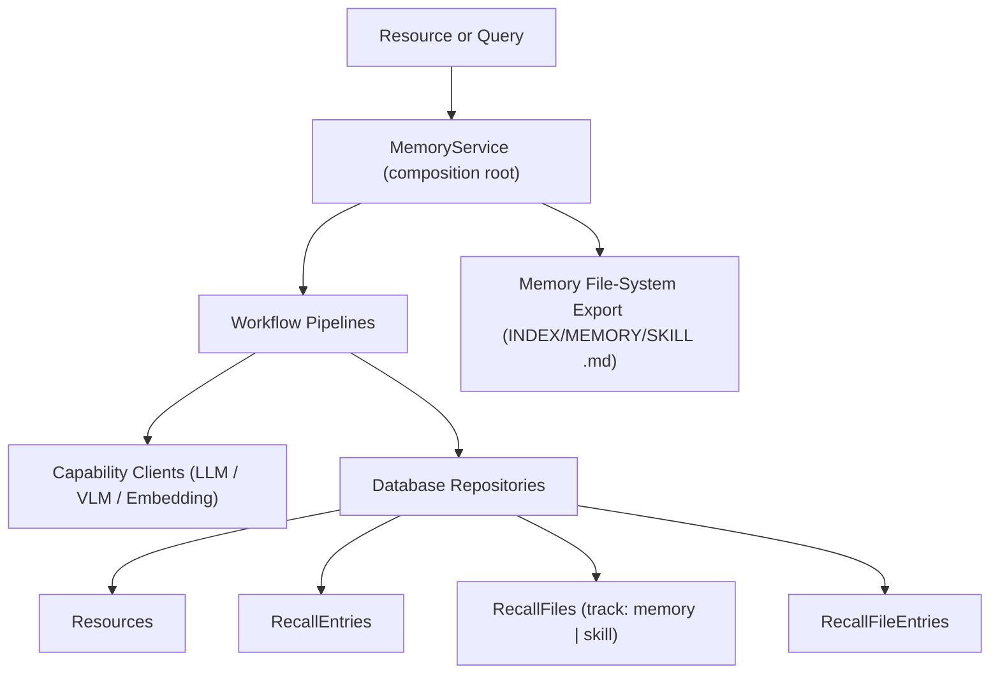

# memU Architecture

## Purpose and scope

This document describes the self-hosted `memu` Python package architecture as
implemented in this repository, reflecting the `RecallFile`/`RecallEntry` data
model and the workspace memorize/retrieve paths introduced by ADR 0006.

The repository also describes a hosted Cloud product in `README.md`, but this
document focuses on the local `MemoryService` runtime and its code paths.

## System overview

memU implements structured agent memory with four persistent record types:

- `Resource`: raw source artifacts (conversation/document/image/video/audio)
- `RecallEntry`: extracted atomic memories with embeddings (`memory_type` + `summary`)
- `RecallFile`: grouped topic files — a memory category **or** a skill, distinguished
  by a `track` column (`"memory" | "skill"`)
- `RecallFileEntry`: entry-to-file relation edges

At runtime, `MemoryService` orchestrates ingestion, retrieval, manual CRUD, and an
optional markdown export over these records.

> **Vocabulary note.** Earlier revisions named these `MemoryItem` /
> `MemoryCategory` / `CategoryItem`. ADR 0006 renamed them to `RecallEntry` /
> `RecallFile` / `RecallFileEntry` (and renamed `RecallFile.summary` → `content`),
> a pure-rename foundation on top of which the skill track was added. A few
> back-compat dict views on the `Database` protocol (`items`, `categories`,
> `relations`) retain the older names.


```mermaid
flowchart TD
  A["Resource or Query"] --> B["MemoryService (composition root)"]
  B --> C["Workflow Pipelines"]
  C --> D["Capability Clients (LLM / VLM / Embedding)"]
  C --> E["Database Repositories"]
  E --> F["Resources"]
  E --> G["RecallEntries"]
  E --> H["RecallFiles (track: memory | skill)"]
  E --> I["RecallFileEntries"]
  B --> J["Memory File-System Export (INDEX/MEMORY/SKILL .md)"]
```

## Core runtime components

### `MemoryService` as composition root

`src/memu/app/service.py` constructs and owns:

- typed configs (`LLMProfilesConfig`, `DatabaseConfig`, `MemorizeConfig`,
  `RetrieveConfig`, `RetrieveWorkspaceConfig`, `MemoryFilesConfig`, `UserConfig`,
  `EmbeddingProfilesConfig`)
- storage backend (`build_database(...)`)
- resource filesystem fetcher (`LocalFS`)
- per-capability client pools (one `ClientPool` each for chat/LLM, VLM and
  embedding; see `src/memu/app/client_pool.py`)
- workflow and LLM interceptor registries
- workflow runner (`local` by default, pluggable)
- named workflow pipelines via `PipelineManager`
- the markdown memory file-system builder (`MemoryFilesBuilder`,
  `src/memu/app/memory_files.py`), which owns the exporter/synthesizer/lock

The three client pools (`ClientPool[Config, Client]`) replace hand-rolled
per-capability caches: each lazily builds and caches a client per profile name
through the matching gateway (`build_llm_client` / `build_vlm_client` /
`build_embedding_client`), so adding a new capability is one more pool rather
than another copy of the get/cache/build dance.

Public APIs are assembled by mixins:

- `MemorizeMixin`: `memorize(...)`, `memorize_workspace(...)`
- `RetrieveMixin`: `retrieve(...)`, `retrieve_workspace(...)`
- `CRUDMixin`: list/clear/create/update/delete memory operations

### Workflow engine

All major operations execute as workflows (`WorkflowStep`) with:

- explicit required/produced state keys (`requires` / `produces`)
- declared capability tags (`llm`, `vector`, `db`, `io`, `vision`)
- per-step config (for profile selection)

`PipelineManager` validates step dependencies at registration/mutation time and
supports runtime pipeline revisioning (`config_step`, `insert_before/after`,
`replace_step`, `remove_step`).

`WorkflowRunner` is a protocol; the default `LocalWorkflowRunner` executes
sequentially with `run_steps(...)`. Workflow state is a plain `dict[str, Any]`,
so step contracts are validated by key names rather than static types.

Registered pipelines (see `MemoryService._register_pipelines`):

| Pipeline                 | Entry point                  |
| ------------------------ | ---------------------------- |
| `memorize`               | `memorize(...)`              |
| `memorize_workspace`     | `memorize_workspace(...)`    |
| `retrieve_rag`           | `retrieve(...)` (method=rag) |
| `retrieve_llm`           | `retrieve(...)` (method=llm) |
| `retrieve_workspace`     | `retrieve_workspace(...)`    |
| `patch_create` / `patch_update` / `patch_delete` | `CRUDMixin` create/update/delete |
| `crud_list_recall_entries` / `crud_list_recall_files` / `crud_clear_memory` | `CRUDMixin` list/clear |

### Interception and observability hooks

Two interceptor systems exist:

- workflow step interceptors: before/after/on_error around each step
- LLM call interceptors: before/after/on_error around `chat/summarize/vision/embed/transcribe`

LLM wrappers also extract best-effort usage metadata from raw provider responses.

## Ingestion architecture (`memorize`)

`memorize(...)` executes the `memorize` pipeline:

1. `ingest_resource`: fetch local/remote resource into `blob_config.resources_dir`
   via `LocalFS`. For the `document` modality, rich formats (PDF, Word,
   PowerPoint, Excel, HTML, EPub) are converted to Markdown text via
   [MarkItDown](https://github.com/microsoft/markitdown) (`memu.blob.document_text`),
   while plain text (`.txt`/`.md`/...) is read directly. MarkItDown is an optional
   extra: `pip install 'memu-py[document]'`.
2. `preprocess_multimodal`: modality-specific preprocessing for
   conversation/document/audio (text-oriented path) and image/video
   (vision-oriented path)
3. `extract_entries`: per-memory-type LLM extraction into structured `RecallEntry`
   records (`memory_type` ∈ profile/event/knowledge/behavior/skill/tool by default)
4. `dedupe_merge`: placeholder stage (currently pass-through)
5. `categorize_entries`: persist resource + recall entries + entry-file relations
   and embeddings (memory track)
6. `persist_index`: update recall-file summaries; optionally persist entry references
7. `build_response`: return resource(s), entries, files, relations

Recall-file (category) bootstrap is lazy and scoped: files are initialized when
needed with embeddings, and mapped by normalized name. New-category creation can
be gated behind `allow_new_categories`.

### Workspace ingestion (`memorize_workspace`)

`memorize_workspace(...)` syncs a folder and, per changed file, runs the
**`memorize_workspace`** pipeline: the standard `memorize` steps plus a final
`generate_skills` step (ADR 0006). That step:

- runs per file, after the memory persist step, taking `preprocessed_resources`
  as input (no data dependency on the memory categorize/persist outputs);
- reads existing `track="skill"` `RecallFile`s from the DB as the "existing skills"
  context, so file *N* sees skills created by files *1..N-1*;
- emits `(name, description, body)` skills and persists each **directly** as a
  `RecallFile(track="skill", content=body)`, embedding `name + description` and
  bypassing the `RecallEntry` plane entirely;
- is gated behind `memory_files_config.synthesize`.

Single-file `memorize(...)` is intentionally left untouched and does **not** run
skill generation or drive the exporter.

## Retrieval architecture (`retrieve`)

`retrieve(...)` chooses one of two pipelines from `retrieve_config.method`:

- `retrieve_rag` (embedding-driven ranking)
- `retrieve_llm` (LLM-driven ranking)

Both share the same staged pattern (step ids):

1. `route_intention` — route intention + optional query rewrite
2. `route_file` — recall-file (category) recall
3. `sufficiency_after_file` — optional early stop
4. `recall_entries` — entry recall
5. `sufficiency_after_entries` — optional early stop
6. `recall_resources` — raw resource recall
7. `build_context` — response build

Key behavior:

- `where` filters are validated against `user_model` fields before querying
- file readers scope to `track="memory"` so skills stay out of memory RAG scoring
- RAG path uses vector similarity (and optional salience ranking for entries)
- LLM path ranks IDs from formatted file/entry/resource context
- each stage can stop early if sufficiency check decides context is enough

### Workspace retrieval (`retrieve_workspace`)

`retrieve_workspace(...)` is the LLM-free, embedding-only counterpart of the
routing-heavy `retrieve` (ADR 0006). Driven by `RetrieveWorkspaceConfig`
(`method="rag"` only), it embeds the query once and ranks the file/entry/resource
layers by vector similarity, with **no** intention routing, query rewrite,
sufficiency checks, or summarization. Steps: `recall_files` → `recall_entries`
→ `recall_resources` → `build_response`. The file layer scopes by track via
`RetrieveFileConfig.tracks`, so skill-track files can be retrieved (or excluded)
independently of the memory track — the read-side mirror of the ingestion track
isolation.

## Data and storage architecture

### Repository contracts

Storage is abstracted through a `Database` protocol (`src/memu/database/interfaces.py`)
with four repositories:

- `ResourceRepo` (incl. `vector_search_resources`)
- `RecallEntryRepo` (incl. `vector_search_items`, similarity/salience)
- `RecallFileRepo`
- `RecallFileEntryRepo`

Vector ranking over **stored** embeddings is a repository responsibility, which
keeps the retrieval layer from reaching into any concrete backend. The pure
cosine/salience math lives in the storage-neutral `memu.vector` module (not under
any backend), so the app layer and every backend depend on it instead of on each
other. (File recall still ranks freshly re-embedded summaries at query time in
the retrieval layer, since that is query-time policy rather than search over
stored vectors.)

### Backends

`build_database(...)` selects backend by `database_config.metadata_store.provider`:

- `inmemory`: in-process dict/list state
- `sqlite`: SQLModel persistence, embeddings stored as JSON text, brute-force cosine search
- `postgres`: SQLModel persistence with pgvector support (when enabled), local fallback ranking when needed

`DatabaseConfig` auto-derives `vector_index`: `pgvector` for postgres, `bruteforce`
otherwise. For Postgres, startup runs migration bootstrap and attempts
`CREATE EXTENSION IF NOT EXISTS vector` in `ddl_mode="create"`.

### Track column and scope model

`RecallFile.track` (`"memory" | "skill"`, default `"memory"`) splits the two
tracks within one table. `get_or_create_category` keys on `(name, track, *scope)`,
and the Postgres unique-with-scope index is `(name, track, *scope)`, so a skill
and a memory category may share a name without colliding. Every `RecallFile`
reader scopes by track through the `where` filter rather than ad-hoc
post-filtering.

`UserConfig.model` is merged into record/table models so scope fields (for example
`user_id`) become first-class columns/attributes across resources, entries, files,
and relations. This is why `where` filters and `user_data` writes are consistently
available across APIs.

## LLM/provider architecture

LLM access is profile-based (`llm_profiles`):

- `default` profile for chat-like tasks
- `embedding` profile for embedding tasks (auto-derived from default if not set)

Per-step profile routing happens through step config (`chat_llm_profile`,
`embed_llm_profile`, or `llm_profile`).

Client backends (selected per profile via `client_backend`):

- `sdk`: official OpenAI SDK wrapper
- `anthropic`: official Anthropic/Claude SDK wrapper
- `httpx`: provider-adapted HTTP backend (OpenAI, Claude, Grok, DeepSeek, Kimi,
  MiniMax, Doubao, OpenRouter — see `memu.llm.backends`)
- `lazyllm_backend`: LazyLLM adapter

### VLM (vision-language) architecture

Image/video understanding uses a dedicated `memu.vlm` package, a sibling of
`memu.llm` mirroring its layout (`backends/`, `*_client.py`, `gateway.py`),
scoped to the multimodal `vision` capability. Only providers whose first-party
API offers native image understanding are included (`memu.vlm.backends`:
OpenAI, Claude, Grok, Kimi, MiniMax, Doubao, OpenRouter); text-only providers
such as DeepSeek are intentionally excluded.

VLM profiles are **derived** from the LLM profiles (`vlm_config_from_llm`): each
VLM client reuses the matching LLM profile's provider, credentials, and
`client_backend`, swapping only the model for that provider's latest VLM
(`memu.vlm.VLM_PROVIDER_DEFAULTS`), falling back to the LLM chat model when the
provider has no known VLM. This makes vision work with zero extra configuration.

During `preprocess_multimodal`, `MemoryService` routes by modality: `image` and
`video` use the VLM client (`_get_vlm_client`, profile from
`memorize_config.vlm_profile`), while `conversation`/`document`/`audio` use the
chat LLM client. VLM clients are cached per profile and wrapped by the same
`LLMClientWrapper`, so interceptors and usage metadata behave identically.

### Embedding (vectorization) architecture

Vectorization uses a dedicated `memu.embedding` package, a sibling of `memu.llm`
and `memu.vlm` mirroring their layout (`backends/`, `*_client.py`/`openai_sdk.py`,
`gateway.py`, `defaults.py`), scoped to the `embed` capability used by vector
search. `memu.embedding.backends` covers OpenAI, Jina, Voyage, Doubao and
OpenRouter; the HTTP client falls back to an OpenAI-compatible backend for any
other provider.

Embedding is **fully decoupled** from the text/chat clients: `OpenAIClient`,
`HTTPLLMClient` and `AnthropicClient` no longer expose `embed()`. All
vectorization — query embedding, file/entry embedding, RAG ranking — flows
through `_get_step_embedding_client` / `_get_embedding_client`, which build
dedicated `memu.embedding` clients. (`LazyLLMClient` remains multi-capability, as
it is the embedding transport for the `lazyllm_backend`.)

Embedding profiles (`EmbeddingConfig`) are **derived** from the LLM profiles
(`embedding_config_from_llm`) by default, reusing each profile's provider,
credentials and transport. Prefer passing an explicit `embedding_profiles` to
`MemoryService` to point vectorization at a dedicated embedding provider (e.g.
`jina`/`voyage`) independently of the chat provider. Embedding clients are built
via `build_embedding_client` (`client_backend`: `sdk`/`httpx`/`lazyllm_backend`;
`anthropic` raises, as Claude has no embeddings API), cached per profile, and
wrapped by the same `LLMClientWrapper`. `_get_step_embedding_client` resolves the
profile from step config (`embed_llm_profile`, default `embedding`).

## Integration surfaces

- `memu.integrations.langgraph`: LangChain/LangGraph tool adapter
  (`save_memory`, `search_memory`)

There is no built-in HTTP server or CLI in this repository; usage is programmatic
via `MemoryService` (the hosted Cloud API is a separate product).

## Memory file system export (`memu.memory_fs`)

`MemoryService.export_memory_files(...)` renders the structured store into a
browsable markdown tree. Each root index sits beside a sibling payload directory:

```txt
<output_dir>/
├── INDEX.md                     ← index of the raw files under resource/
├── MEMORY.md                    ← overview + index of memory/
├── SKILL.md                     ← overview + index of skill/
├── resource/
│   └── <file_name>              ← one copied raw source file (verbatim bytes)
├── memory/
│   └── <slug>.md                ← one memory-track RecallFile (description + content)
├── skill/
│   └── <slug>.md                ← one skill-track RecallFile (description + content)
└── .memufs_manifest.json        ← per-artifact content hashes (diff detection)
```

- `resource/` holds the raw source files copied verbatim out of the blob store
  (`Resource.local_path`); `INDEX.md` indexes them (name, modality, description,
  link).
- `memory/<slug>.md` is one file per `track="memory"` `RecallFile`; `MEMORY.md`
  links to each one.
- `skill/<slug>.md` is one file per `track="skill"` `RecallFile`, rendered by the
  **same** track-agnostic renderer as `memory/` (ADR 0006). Skills are now
  first-class rows, not an export-time synthesis artifact — the old
  `skill/<name>/SKILL.md` folder layout is gone.

### Deterministic vs. synthesized

`INDEX.md`, the `resource/` copies, and the per-file `memory/<slug>.md` /
`skill/<slug>.md` documents are **always deterministic** — recomputed from the
current store, no LLM. Rendered content avoids volatile values so an unchanged
store re-exports as a no-op.

The two root overviews are deterministic link indexes by default. When
`memory_files_config.synthesize=True`, `MemoryFilesBuilder` synthesizes their
bodies with the `synthesis_llm_profile` LLM:

- `MEMORY.md` is synthesized from the per-source multimodal descriptions
- `SKILL.md` is synthesized from the skill-track files' bodies (the mirror of
  `MEMORY.md`)

### Initialize vs. incremental update

`MemoryFilesBuilder.build(database, where, changed=...)` decides between two paths:

- **Initialization** (no prior tree on disk, or `changed is None`): rebuild from
  the full scoped store. `export_memory_files(user=...)` always takes this path.
- **Incremental update** (a tree already exists and a changed set is supplied):
  read existing overview bodies back off disk and merge only the changed sources'
  descriptions into them.

`memorize_workspace(...)` drives this builder after each folder sync — passing the
just-created resources as the changed set, or forcing a full rebuild when files
were modified/deleted. That refresh is best-effort: an export failure is logged
and never fails the sync, since the structured memory is already persisted. The
exporter is read-only against the database, disabled by default
(`memory_files_config.enabled`), and serialized through a per-service lock.

## Current constraints and tradeoffs

- workflow state is dict-based, so step contracts are validated by key names
  rather than static types
- SQLite/inmemory vector search is brute-force (portable but less scalable)
- file/entry summary and extraction quality are prompt/LLM dependent
- the `dedupe_merge` stage is a placeholder (currently pass-through)
- **skill provenance/deletion is a known, deferred gap** (ADR 0006): skill
  `RecallFile`s bypass the `RecallEntry` plane and have no link back to their
  source resources, so they do not invalidate on source change/delete. The skill
  track is currently append/merge-only.

## Related ADRs

- `docs/adr/0001-workflow-pipeline-architecture.md`
- `docs/adr/0002-pluggable-storage-and-vector-strategy.md`
- `docs/adr/0003-user-scope-in-data-model.md`
- `docs/adr/0004-workspace-memorize-and-memory-file-system.md`
- `docs/adr/0005-dedicated-embedding-package.md`
- `docs/adr/0006-from-memory-item-category-to-tracked-workspace-memorization.md`
