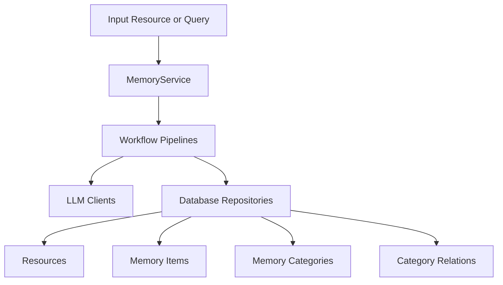

# memU Architecture

## Purpose and scope

This document describes the self-hosted `memu` Python package architecture as implemented in this repository.

The repository also describes a hosted Cloud product in `README.md`, but this document focuses on the local `MemoryService` runtime and its code paths.

## System overview

memU follows the "memory as file system" concept from the README and implements it with three persistent layers:

- `Resource`: raw source artifacts (conversation/document/image/video/audio)
- `MemoryItem`: extracted atomic memories with embeddings
- `MemoryCategory`: grouped topic summaries
- `CategoryItem`: item-category relation edges

At runtime, `MemoryService` orchestrates ingestion, retrieval, and manual CRUD over these layers.

## Core runtime components

### `MemoryService` as composition root

`src/memu/app/service.py` constructs and owns:

- typed configs (`LLMProfilesConfig`, `DatabaseConfig`, `MemorizeConfig`, `RetrieveConfig`, `UserConfig`)
- storage backend (`build_database(...)`)
- resource filesystem fetcher (`LocalFS`)
- LLM client cache and wrappers
- workflow and LLM interceptor registries
- workflow runner (`local` by default, pluggable)
- named workflow pipelines via `PipelineManager`

Public APIs are assembled by mixins:

- `MemorizeMixin`: `memorize(...)`
- `RetrieveMixin`: `retrieve(...)`
- `CRUDMixin`: list/clear/create/update/delete memory operations

### Workflow engine

All major operations execute as workflows (`WorkflowStep`) with:

- explicit required/produced state keys
- declared capability tags (`llm`, `vector`, `db`, `io`, `vision`)
- per-step config (for profile selection)

`PipelineManager` validates step dependencies at registration/mutation time and supports runtime pipeline revisioning (`config_step`, `insert_before/after`, `replace_step`, `remove_step`).

`WorkflowRunner` is a protocol; default `LocalWorkflowRunner` executes sequentially with `run_steps(...)`.

### Interception and observability hooks

Two interceptor systems exist:

- workflow step interceptors: before/after/on_error around each step
- LLM call interceptors: before/after/on_error around `chat/summarize/vision/embed/transcribe`

LLM wrappers also extract best-effort usage metadata from raw provider responses.

## Ingestion architecture (`memorize`)

`memorize(...)` executes the `memorize` pipeline:

1. `ingest_resource`: fetch local/remote resource into `blob_config.resources_dir` via `LocalFS`
2. `preprocess_multimodal`: modality-specific preprocessing for conversation/document/audio (text-oriented path) and image/video (vision-oriented path)
3. `extract_items`: per-memory-type LLM extraction into structured entries
4. `dedupe_merge`: placeholder stage (currently pass-through)
5. `categorize_items`: persist resource + memory items + item-category relations and embeddings
6. `persist_index`: update category summaries; optionally persist item references
7. `build_response`: return resource(s), items, categories, relations

Category bootstrap is lazy and scoped: categories are initialized when needed with embeddings, and mapped by normalized category name.

## Retrieval architecture (`retrieve`)

`retrieve(...)` chooses one of two pipelines from config:

- `retrieve_rag` (embedding-driven ranking)
- `retrieve_llm` (LLM-driven ranking)

Both use the same staged pattern:

1. route intention + optional query rewrite
2. category recall
3. sufficiency check (optional)
4. item recall
5. sufficiency check (optional)
6. resource recall
7. response build

Key behavior:

- `where` filters are validated against `user_model` fields before querying
- RAG path uses vector similarity (and optional salience ranking for items)
- LLM path ranks IDs from formatted category/item/resource context
- each stage can stop early if sufficiency check decides context is enough

## Data and storage architecture

### Repository contracts

Storage is abstracted through a `Database` protocol with four repositories:

- `ResourceRepo`
- `MemoryItemRepo`
- `MemoryCategoryRepo`
- `CategoryItemRepo`

### Backends

`build_database(...)` selects backend by `database_config.metadata_store.provider`:

- `inmemory`: in-process dict/list state
- `sqlite`: SQLModel persistence, embeddings stored as JSON text, brute-force cosine search
- `postgres`: SQLModel persistence with pgvector support (when enabled), local fallback ranking when needed

For Postgres, startup runs migration bootstrap and attempts `CREATE EXTENSION IF NOT EXISTS vector` in `ddl_mode="create"`.

### Scope model propagation

`UserConfig.model` is merged into record/table models so scope fields (for example `user_id`) become first-class columns/attributes across resources, items, categories, and relations.

This is why `where` filters and `user_data` writes are consistently available across APIs.

## LLM/provider architecture

LLM access is profile-based (`llm_profiles`):

- `default` profile for chat-like tasks
- `embedding` profile for embedding tasks (auto-derived from default if not set)

Per-step profile routing happens through step config (`chat_llm_profile`, `embed_llm_profile`, or `llm_profile`).

Client backends:

- `sdk`: official OpenAI SDK wrapper
- `httpx`: provider-adapted HTTP backend (OpenAI, Doubao, Grok, OpenRouter)
- `lazyllm_backend`: LazyLLM adapter

## Integration surfaces

- `memu.client.openai_wrapper`: opt-in OpenAI client wrapper that auto-retrieves memories and injects them into system context
- `memu.integrations.langgraph`: LangChain/LangGraph tool adapter (`save_memory`, `search_memory`)

## Current constraints and tradeoffs

- workflow state is dict-based, so step contracts are validated by key names rather than static types
- SQLite/inmemory vector search is brute-force (portable but less scalable)
- category update quality and extraction quality are prompt/LLM dependent
- some extension hooks exist as placeholders (for example dedupe/merge stage)

## Related ADRs

- `docs/adr/0001-workflow-pipeline-architecture.md`
- `docs/adr/0002-pluggable-storage-and-vector-strategy.md`
- `docs/adr/0003-user-scope-in-data-model.md`
